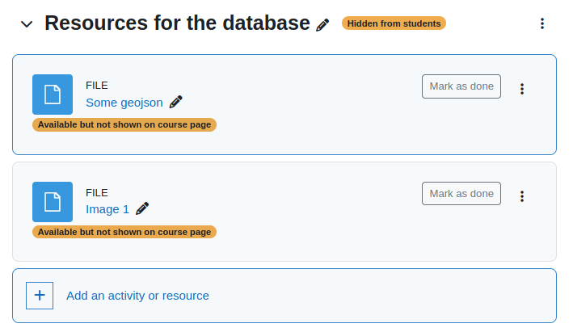

# moodle-database-presets
Presets for the Moodle database activity

## Overview

With the Moodle database activity many cool things can be created. In this repo I share some of my presets.
Inside the subdirectories the template files of the preset are included. Other files that are in the subdirectory
may contain additional data (images, metadata) so that the database activity works in the expected way.

## Content

Inside each subdirectory is an additional README.md that explains the specific preset.

### [Map with OSM and SVG](map-osm-and-svg)

### [Switzerland place names](ch-place-names)

### [Image gallery v2](image-gallery-v2)

### [Animated bar chart](barchart-animated)

### [Accumulated pie chart](piechart-accumulated)

## Installation

Any of these examples can be installed in your Moodle installation in the
following way:
1. In your course, create a new database activity. Give it a name and click on "Save and display".
2. In the next screen click the button "Import a preset", select the zip file for upload and click "Import preset and apply".
3. When the import was successful you should see a list of the field definitions.
To check the templates navigate in the tab to the template section and check them.

Before you see anything, start creating a few entries or import a sample dataset when provided.

Detailed instructions how templates should be applied to fit your needs are described
at each readme file inside the subdirectory of the preset.

## Additional data in templates

Some of the examples use additional data (such as images or json) in the templates
of the database activity. This data can be stored elsewhere (e.g. public available resources
such as wikipedia etc.) and then referred by the URL inside the template.

If you do not want to rely on external resources you also have the change to upload
the data into the Moodle course itself. What I find useful is to create a new
file resource, upload the file there and then use the preview link of that file inside
the template. In order to hide the resource from general access, I created an
additional section which is invisible in the course. The uploaded files would be
invisible as well, however you can make them accessible even they do not show up
in the course overview.

**Note**: whenever you export/import or copy the database activity these files must
be copied as well and the links in the templates must be adapted to the new location.
If you use external URLs then this is not necessary.