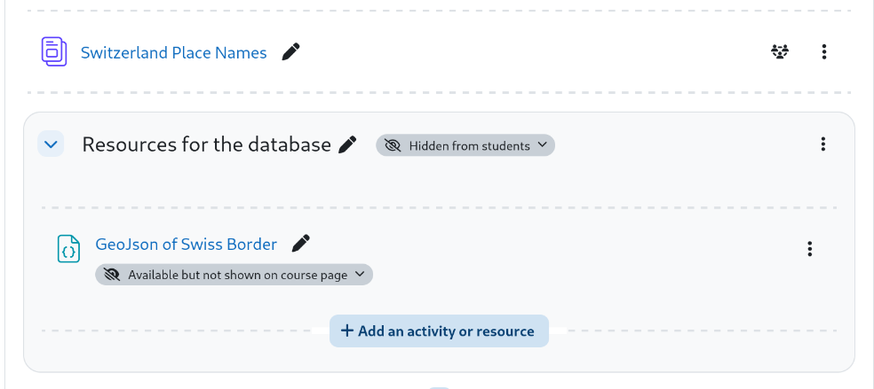

# moodle-database-presets
Presets for the Moodle database activity

## Overview

With the Moodle database activity many cool things can be created. In this repo I share some of my presets.
Inside the subdirectories the template files of the preset are included. Other files that are in the subdirectory
may contain additional data (images, metadata) so that the database activity works in the expected way.

## Content

Inside each subdirectory is an additional README.md that explains the specific preset.

### [Map with OSM and SVG](map-osm-and-svg)

Create SVG maps from the data, use Open Street Map to enter data sets. 
Download Link:
<a href="map-osm-and-svg.zip" download="map-osm-and-svg.zip">map-osm-and-svg.zip</a>

### [Switzerland place names](ch-place-names)

Create SVG maps from the data, download the dynamically created SVG and have a QR code for the parameterized search. 
Download Link:
<a href="ch-place-names.zip" download="ch-place-names.zip">ch-place-names.zip</a>

### [Image gallery v2](image-gallery-v2)

Improved image gallery that looks more modern than the original preset from Moodle. 
Download Link:
<a href="image-gallery-v2.zip" download="image-gallery-v2.zip">image-gallery-v2.zip</a>

### [Animated bar chart](barchart-animated)

Pick one choice from a selection list. Results are displayed in a animated bar chart and can be periodically refreshes while the activity is ongoing. 
Download Link:
<a href="barchart-animated.zip" download="barchart-animated.zip">barchart-animated.zip</a>

### [Multiple Choice Question](mc-question)

Answer a multiple choice question and see live results how participants answered that question. 
Download Link:
<a href="mc-question.zip" download="mc-question.zip">mc-question.zip</a>

### [Accumulated pie chart](piechart-accumulated)

Kind of a voting machine, vote for one or more options in a well-designed new entry page. The result is displayed as a pie chart. 
Download Link:
<a href="piechart-accumulated.zip" download="piechart-accumulated.zip">piechart-accumulated.zip</a>

### [Wordcloud list](wordcloud-list)

A wordcloud built from terms entered as datasets. 
Download Link:
<a href="wordcloud-list.zip" download="wordcloud-list.zip">wordcloud-list.zip</a>

### [Wordclound text](wordcloud-text)

A wordcloud built from texts entered as datasets. 
Download Link:
<a href="wordcloud-text.zip" download="wordcloud-text.zip">wordcloud-text.zip</a>

### [Sign up for a project](project-signup)

A database activity for a project list and a possibility to assign applicants to the
project. The preset demonstrates how to group several fields in different tables and
has a solution for field labels in different languages. 
Download Link:
<a href="project-signup.zip" download="project-signup.zip">project-signup.zip</a>

### [Cards in masonry layout](cards-in-masonry-layout)

Show cards in a masonry layout style. Each database entry represents one card, that can be of
a certain type. Depending on the type the background color is different. The cards are displayed
in a grid with on e to three columns, depending on the screen size. 
Download Link:
<a href="cards-in-masonry-layout.zip" download="cards-in-masonry-layout.zip">cards-in-masonry-layout.zip</a>

### [Personel list (with print function)](personel-list)

Collect and display information about personel. The preset also includes
a print function so that the list view can be easily transferred into a
PDF via the print function. 
Download link:
<a href="personel-list.zip" download="personel-list.zip">personel-list.zip</a>

### [First, second and third choice](choice)

Having a list of items to select from, users should vote for their most favourite item (first choice),
another item as second choice and a last item as third choice. 
Download link:
<a href="choice.zip" download="choice.zip">choice.zip</a>

### [Choice of items with duration](choice-duration)

Having a list of events, users are forced to choose only so many that the selected events fit into
an overall duration time. 
Download link:
<a href="choice-duration.zip" download="choice-duration.zip">choice-duration.zip</a>

### [Table with sorting per column](table-sort)

List the dataset in an HTML table that can be sorted ascending or descending by a certain column. 
Download link:
<a href="table-sort.zip" download="table-sort.zip">table-sort.zip</a>

### [Table with sorting by several criteria](table-multisort)

List the dataset in an HTML table that can be sorted ascending or descending by several columns at once. 
Download link:
<a href="table-multisort.zip" download="table-multisort.zip">table-multisort.zip</a>

## Installation

Any of these examples can be installed in your Moodle installation in the
following way:
1. In your course, create a new database activity. Give it a name and click on "Save and display".
2. In the next screen click the button "Import a preset", select the zip file for upload and click "Import preset and apply".
3. When the import was successful you should see a list of the field definitions.
To check the templates navigate in the tab to the template section and check them.

Before you see anything, start creating a few entries or import a sample dataset when provided.

Detailed instructions how templates should be applied to fit your needs are described
at each readme file inside the subdirectory of the preset.

## Additional data in templates

Some of the examples use additional data (such as images or json) in the templates
of the database activity. This data can be stored elsewhere (e.g. public available resources
such as wikipedia etc.) and then referred by the URL inside the template.

If you do not want to rely on external resources you also have the chance to upload
the data into the Moodle course itself. What I find useful, is to create a new
file resource, upload the file there and then use the preview link of that file inside
the template. In order to hide the resource from general access, I created an
additional section which is invisible in the course. The uploaded files would be
invisible as well, however you can make them accessible even they do not show up
in the course overview.

**Note**: whenever you export/import or copy the database activity these files must
be copied as well and the links in the templates must be adapted to the new location.
If you use external URLs then this is not necessary.

## Multilanguage

The database UI is multi-language capable like any other component in Moodle.
The templates themselves are not language capable. Whatever you type in the templates, or values
that are entered in the database, are returned as they are.
However, there is a solution at least for the templates itself. Details are in the preset
"Sign up for a project".

## Other resources

Florian Danger of Mebis has got a large collection of database presets and other resources for
Moodle at https://fdagner.notion.site/0cfe4ce41b2d463da99e0d08c825a461

Mebis itself has a
[taskboard](https://www.taskcards.de/#/board/a29aa0a2-38bb-4a9a-90e1-4c38ec47f9cc/view?token=8d6e8433-486a-4717-85ee-d721aefcadb1)
with a lot of ideas.

The [Schulportal Hessen](https://mo1300.schule.hessen.de/course/view.php?id=41) contains
another collection of database ideas and preset.

## FAQ

From the official forum and other resources I started to create a [FAQ](FAQ.md)
that should answer some questions that may arise when creating custom presets.