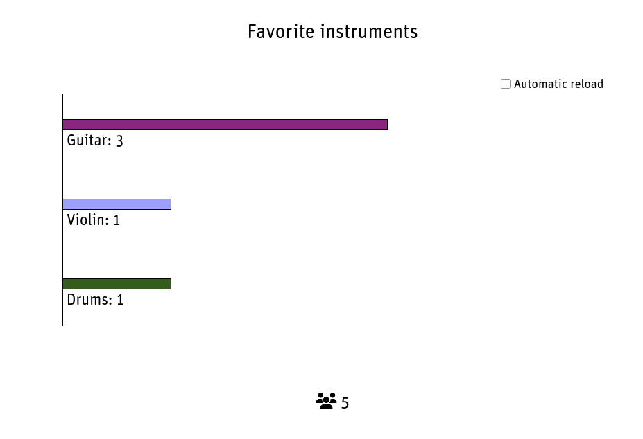
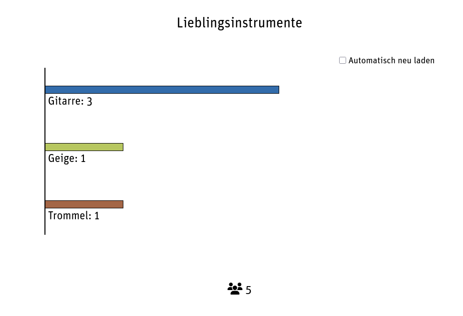
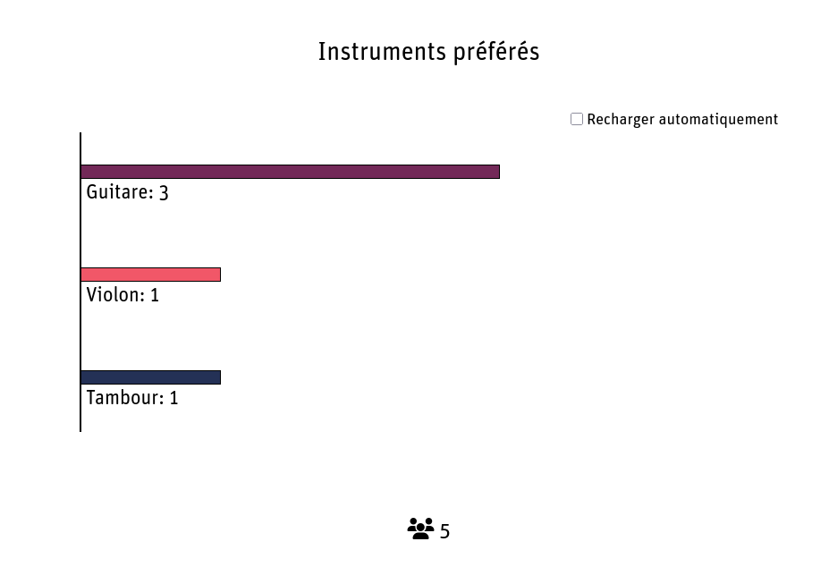

## Animated barchart multilang

To demonstrate the multi language possibility at first I extended the previous
example of the "Animated barchart" which gives an idea on how to translate
labels in the template.

The values however, are typed in as the user provides them. Textfields, textareas,
uploaded files etc. are not translated. Selections on the other hand, may have a
value and a representation of that value. In this case there, it's a translated label.

<div style="margin: 0 25%">







</div>

## Multilanguage for the selection

The labels are translated in the same way as in the "Animated barchart" preset. What differs
here from the previous example is the fact that the values of the selection field contain
no language neutral icons, but a text value. This is the value that is stored with the data
and what is also received when the data is exported.

### Replacing the placeholder

Whenever `[[instrument]]` is used as a placeholder, this must be replaced with a custom
implementation. In all list templates, instead of the value, the translated text label
must be shown. In the *Add entry template* the placeholder is replaced by the html `select`
element with all possible values. This must be done manually.

All values that must be translated, are wrapped into a html element e.g. instead of using:

```
[[instrument]]
```

we use something like:

```
<span class="translate-instrument">[[instrument]]</span>
```

The *Custom Javascript* contains a function that selects all html
elements with the class name "translate-instrument" takes the value
and passes it to the translation function. The received value is then
inserted as a child of the html element, replacing the plain value that
was inserted where the placeholder was located at.

The selection in the *Add entry template* must be added manually. Instead
of having just the placeholder

```
[[instrument]]
```

which automatically builds the select html, it must be created like this:

```
<select name="[[instrument#id]]">
  <option class="translate-instrument" value="violin">violin</option>
  <option class="translate-instrument" value="guitar">guitar</option>
  <option class="translate-instrument" value="drums">drums</option>
  <option class="translate-instrument" value="saxophone">saxophone</option>
  <option class="translate-instrument" value="piano">piano</option>
  <option class="translate-instrument" value="radio">radio</option>
</select>
```

### Tranlation function

The *Custom Javascript* hold the handling of the translation and the
translation of the values.

For each value (you can combine these from several fields as long as they
are unique) you define a translation for all the desired languages:

```
  const labels = {
    violin: {
      de: 'Geige',
      en: 'Violin',
      fr: 'Violon'
    },
    guitar: {
      de: 'Gitarre',
      en: 'Guitar',
      fr: 'Guitare'
    },
    drums: {
      de: 'Trommel',
      en: 'Drums',
      fr: 'Tambour',
    },
    saxophone: {
      de: 'Saxofon',
      en: 'Saxophone',
      fr: 'Saxophone'
    },
    piano: {
      de: 'Klavier',
      en: 'Piano',
      fr: 'Piano'
    },
    radio: {
      de: 'Radio',
      en: 'Radio',
      fr: 'Radio'
    }
  };
```

If your value has special chars or spaces, you can use the quotes around
them and the properties work in the same way.

Note that the translations are inside the function `instrumentLabel` which encapsulated
it to the outside. The function must be defined in the global scope so give it a
distinguishable and unique name.

The whole function looks like this:

```
const instrumentLabel = (val) => {
  const labels = { ... }
  const currentLang = getCurrentLangForInstruments();
  if (labels.hasOwnProperty(val)) {
    return labels[val][currentLang];
  }
  return val;
};
```

When the input is a string that exists as a property in the `labels` object,
then we return the translation, otherwise the value is retured as it is, e.g.
the plain text value remains as it is.

There is another helper function to get the current used language.

Finally the event `DOMContentLoaded` gets two new event listeners attached that
either

* check for all "multlang" class elements and removes them, where the language is
not matching (this is like the multilang filter works)
* check for all "translate-instrument" class elements, that calls the translation
function to replace the plain text value with the returned translated label.

```
document.addEventListener('DOMContentLoaded', () => {
  const currentLang = getCurrentLangForInstruments();
  document.querySelectorAll('.favorite-instrument .multilang').forEach((e) => {
    if (e.getAttribute('lang') !== currentLang) {
      e.remove();
    }
  });
  document.querySelectorAll('.translate-instrument').forEach((e) => {
    e.innerHTML = instrumentLabel(e.textContent.trim());
  });
});
```
