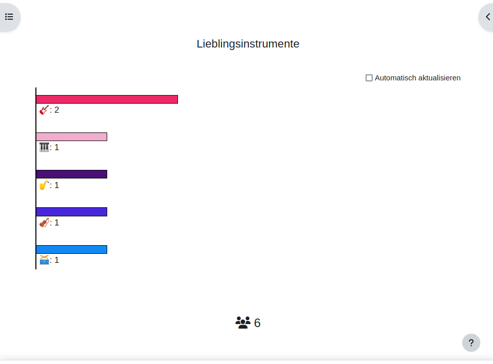
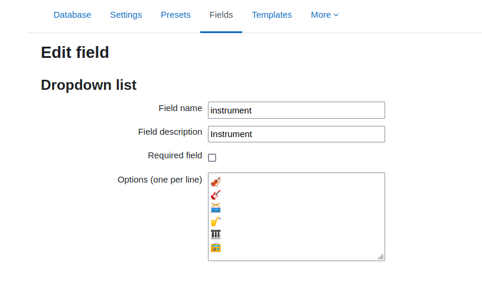

## Animated barchart

This idea was originally derived from 
[Tipps und Tricks zu Moodle in mebis - Datenbankvorlage: Balkendiagramm](https://fdagner.notion.site/Datenbankvorlage-Balkendiagramm-50070ca4c56747be834781286122509b).
When I use the code it had some other code leftovers. I reused it, changed
the animal icons for instruments and cleared out all code that didn't make sense
in the current setup.

The bars are animated, counting each selection from tbe possible options and
creates a barchart based on the percentage how many times a single option has
been chosen.

There's a nice reload option that when you check the checkbox, the chart is reloaded
every 15 seconds. This makes it quite useful if you have an ongoing event and
want to display the progress.

## Installation

Note: there seems to be a bug when importing the preset. Each option has to be on a separate
line, via a line break. When creating this preset I had some trouble to do so. The
final solution that worked was to use the unicode sequence (you will see the icon in the file
when opening in the text editor). Using the html entities or having no windows line breaks
in it caused problems and all options where at one line.