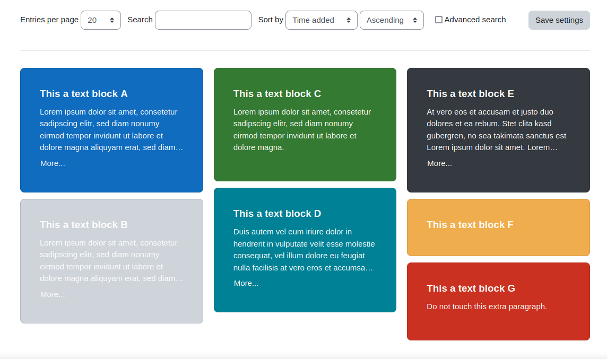

## Cards in masonry layout

Many sites organize their content in little cards that are displayed in a grid on the
webpage. The cards are cascading on the page, and are displayed in several columns. Due to
responsiveness the columns may vary depending on the screen size.

[Masonry](https://masonry.desandro.com/) is a Javascript library, that can be used to create
such a layout. [Padlet](https://padlet.com) makes also use of this layout. It's the base of
structuring their content.

### Technical details

With Bootstrap 5 a [Masonry Cards Layout](https://kontext.tech/article/784/bootstrap-5-masonry-cards-layout)
can be created easily. Moodle still has Bootstrap 4 included, so the above solution is not
usable for the database activity. However, the masonry layout can be also achieved with Bootstrap 4.
This preset does not use any additional libraries, only the built-in functionality of Bootstrap 4
to achieve the same. The final solution is not as perfect as in Bootstrap 5 but still looks
good.

This preset contains three columns, `card_type` for the card type (basically it defines the background
color of the card using the default colors of bootstrap), `card_title` for the title of the card that
is put into `<h5>` tags, and `card_content` that contains the content of the card. This can be
arbitrary HTML. Even images can be used there.

The *Add entry template* is modified in that way, that when changing the card type, a little
preview is shown how the card would look like.

The *Custom CSS* template contains styles for this little card preview in the *Add entry template* 
and also adds media queries, that defines the used columns for the card layout, depending
on the screen with.

A dataset sample in `sample-cards.csv` can be used to see how the page would look like with the
different card types. It contains basically what is shown in the screenshot. 

If you want to have your cards look a bit different, e.g. have round corners, then add the
classes to the *List view template* in the HTML for each entry. A lot of styles already exist
via bootstrap in classes so only these specific classes need to be added to the `
` element.
Only if you need a special style that does not yet exist, the use the *Custom CSS* template
to define it. 
