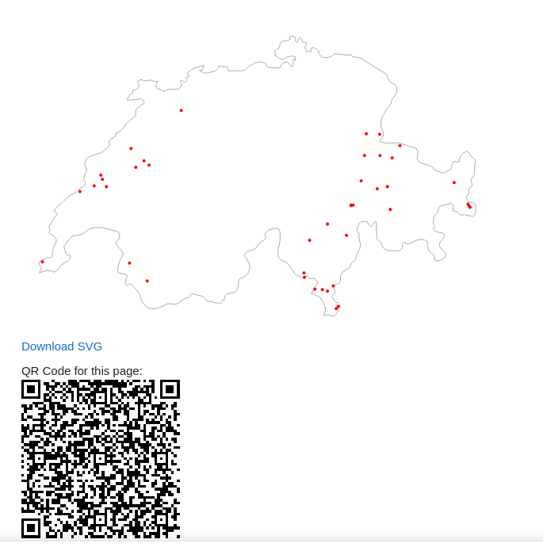

## Switzerland place names

This is a preset that makes more sense with the accompanied dataset. The database
provides an SVG map of Switzerland with a list of all towns and villages. The handling
is very similar to the [Map with OSM and SVG](../map-osm-and-svg) example.
The differences are:
- this example has not the Open Street Map service included (assuming that the
list of the named places is complete).
- The resulting SVG map can be downloaded.
- A QR code from the current parameterized url of the list template is available.

The main usage of the dataset would be probably via the list page. Because the
dataset contains more than 10k entries, not all entries are displayed. Therefore,
it makes sense to do some search on the name and increase the displayed results
to the maximum possible to have a reasonable result.

## Installation

After installing the preset you should probably also include the list of places
from the [`dataset.csv`](dataset.csv) file and import this dataset. The
delimiter of the data is the semicolon, that must be properly adjusted at
the import page.

## Credits

The dataset with the list of places has been taken from [Geonames](https://www.geonames.org)
and can be used under the **cc-by licence**.

The map data with the swiss border was taken from 
https://www.naturalearthdata.com/ from the Admin 0 Countries.
