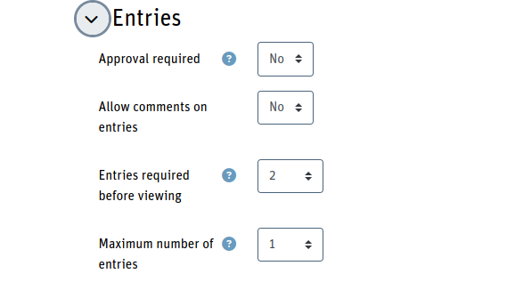

## Choice of items with duration

This set is an adaption of the [First, second and third choice](../choice/)
preset. The usecase here is to let participans choose from several events at a
conference. There is a block when several workshops,talks and demos take place
at the same time and the participants should choose which of the events to
select for themselves.

The result can be used in several ways:

* See which event is well attended and which is not.
* In case the selection is presented before the events are scheduled, depending
on the interests, events may be planed in parallel.

To serve the second case, it's the best to export the collected data and process
them offline. In this preset the *List view template* shows the list of events
together with the votes each received and a download link to export the data
as CSV.

### General setup of the activity

The database fields consist of one single short text field which is mandatory.
The field itself is hidden. The list of events is defined in the
*Custom JavaScript* template in the `listOfChoices` array. Each element of
that array represents one event e.g.
```
{
  name: 'Workshop 2 Title',
  user: 'Presenter Name',
  duration: 90
}
```

The duration is important. The idea is that the events run in parallel in
several timeslots. People can only choose events that fit into an overall
duration time which is set in `const maxDuration = 180;` (here 3 hours).

Because the field `[[choice]]` is mandatory and there is a check if the
selected item list is empty, the user must check at least one checkbox.

Also, the user cannot select events that together would exceed the maximum
time. After each click, the duration of the selected events is summarized
and all other events that would exceed the maximum time, when selected
as well, are disabled.

The data that is stored is an array of selected events in the JSON notation
e.g. if the Workshop 2, Talk 5 and Demo 8 are selected the stored
value is:

```
["1","4","7"]
```

The numbers refer to the item index of the `listOfChoices` array starting
at 0.

Note: the indices are stored as a string. When these are read to display
the seleced values in the view template, the index is casted into an
integer before it can be used as an index for the array.

In the settings you should allow the user to add a single entry only
and that the user must at least provide more than one entry to see the result.

<div style="margin: 0 25%">



</div>

The effect of this setting is that the ordinary user will never see the
results (except his own choice in the single view entry) and that the
user can vote once (e.g. add one entry only). For a clean user experience
we must remove the alert message that the user must add more entries before
viewing the results.

### Customization

To customize the event list, change the `listOfChoices` array must be
adapted in the *Custom JavaScript* template. The display of the data is
also done mainly in that template.

The display of the input list in the *Add entry template* is handled
via the variable `TMPL_INPUT_ENTRY`. The content of the
*Single view template* is done via `TMPL_ITEM_ENTRY`. The *List view
template* makes use of the `TMPL_LIST_ENTRY`. In the function
`displayVotes()` the two labels of the list header are defined.

The *Custom CSS* template contains the "min." suffix that is displayed
at the duration of a single event. If you have other or no units, you
can change it there as well as control the output of the data. In this
example the event name is displayed as a block element, the presenter
name and the duration are inline elements.

### Optimal use of the duration time

At the moment there is not check that the user has selected as many events
to fill the maximal available duration in an optimal way. In this example
it would be possible to fill the 3 hours by choosing e.g.:

* Workshop 1
* Workshop 2 and Workshop 3
* Workshop 3 and Talk5 and Talk 7
* Workshop 5 and all of the 3 Demos

If you want the user to choice as many events as possible to fulfill
the maximum duration, the *Add new entry* template must be exceeded
by code to check the total selected duraction and the maximum duration.

The function that is attached to the click event of the buttons in the
bottom may look like this:

```
e.addEventListener('click', (e) => {
  const { items, duration } = getSelectedChoices();
  if (items.length === 0) return;
  if (duration < maxDuration) {
    e.preventDefault();
    if (document.querySelector('.duration-error')) return;
    document.getElementById('defaulttemplate-addentry').insertAdjacentHTML(
      'afterbegin',
      '<div class="alert alert-danger duration-error">Please add more events to fill the complete time frame</div>'
    );
    return;
  }
  document.getElementById('[[choice#id]]').value= JSON.stringify(items);
});
```

When there is no value set at all, `items.length` is zero. However, we
do submit the form only to get the error of an empty mandatory field.

The new part that doesn't exist in the template is the conditional block
with the check whether `duration < maxDuration`. If that's the case the
user may choose still another event. In this case (if not already in the
document, add the alert box with the appropiate message. Also, note that
here we prevend sending the form and stay on the page.

It's important that the list of events allows a selection of the exact
maximum duration time (like in the example). If that's not possible,
then do not add this check.

### Get the results

On the list view page, a table is displayed with the possible events and
the number of votes that want to attend this event. From that list you
cannot see who wants to attent which event and personalize the invitation
for each user based on his choice.

Therefore, the admin needs a list of the choices together with the user
information. This is done by taking the list of choices together with
the user data (here we use `##user##` that returns a link to the users
page and the name inside the anchor tag) combined with the content of
the data base field `choice` that contains the array with the numbers
of the selected events from the list.