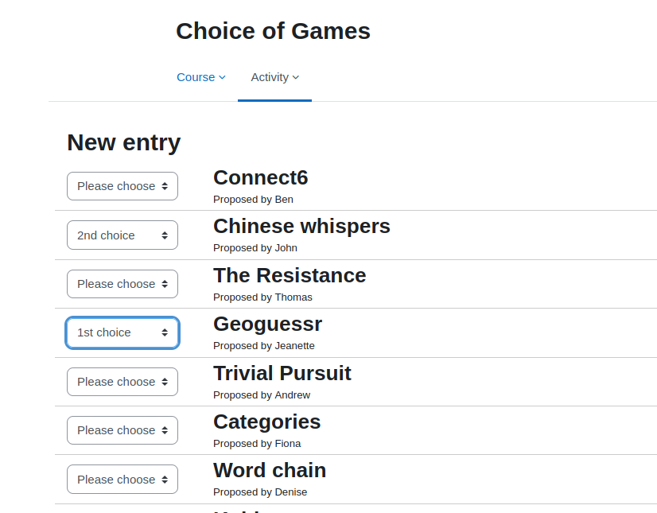
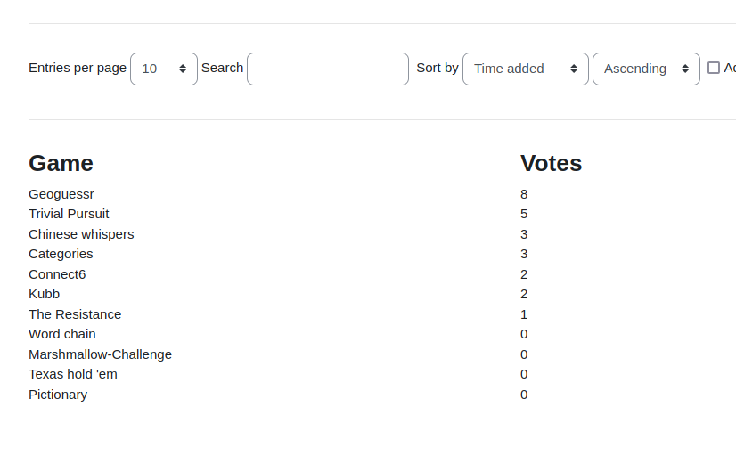
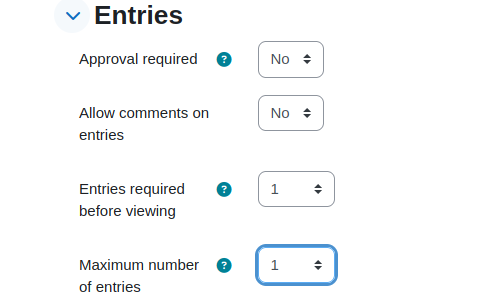

## Choice

This preset was developed on the use case to get a ranking of a list of items.
In this special case there is a list of party games, proposed by team members and
the team should pick the favourit game from the list. Each user has three choices
which are mandatory. The user may pick one item as the first choice (awarded by
3 points), one item as a second choice (awarded by 2 points) and another item as
the third choice (awarded by one point).

The result is a sorted list of items ordered from top with the most points down
to bottom with the least points received.

This database activity makes sense of being the only one in a "single activity"
course format.

<div style="margin: 0 25%">




</div>

### General setup of the activity

The database fields consist of the three choices. Each dataset represents a pick
of a user where he makes his preferred choices on the items. Each field is a
number field, containing the item number that was choosen in that rank. To sum
up the result, the items in `choice_first` are multiplied by 3, the items in
`choice_second` by two and the items in `choice_third` are multiplied by one.

In the activity itself it probably makes sense to have the entries setup in the
way that each one can enter one entry only, and results should be shown after
the entry has been added.

<div style="margin: 0 25%">



</div>

### Item list

The list of items is defined in the *Custom JavaScript* template along with
functions to display the information in the other templates, mainly adding,
displaying one entry and displaying the list of all entries.

From the field list, the description is used as well. It is displayed in
the selection list in the *Add entry template*.

The fields itself are set as hidden fields in the *Add entry template* which
are filled by the selection when the button "Save" button is hit in the add
entry page. Because the fields are mandatory, the user needs to provide three
picks. If none is provided, Moodle shows an error message telling that no
field has been filled out. If there is at least one choice provided but not
all, nothing happens, the user gets back the the entry page without an error
message.

### Customize the item list

The items can be defined and configured in the *Custom JavaScript* template.

In this example, an item consists of two properties:
```
{
    name: "Item name to choose",
    user: "Some other information for that item"
}
```

Remove or add items as you wish, unless you have no datasets (e.g. votes) yet.

This list is used to build up a list consisting of the item information and
a selection for the preferred choice. This is done via the function
`displayChoices()`. That function makes use of the template variable
`TMPL_INPUT_ENTRY`.

In the same way the ranking of all choices is displayed. This is done via
the function `displayVotes()` and the template variable `TMPL_LIST_ENTRY`.
When displaying the results, the votes must be submitted to that function.
This is done in the *List view template*. Each entry looks like this:

```
[ 3, 5, 1]
```
This code means the users first choice was item number 4, second choice was
item number 6 and the third choice was item number 2 (starting to count the
list of items at 0).

There are many of these entries, so the function needs to calculate the votes
for each item respectively and also display the items ranked by the votes and
not as they are defined in the list.

For some reason, the `[[choice_first#name]]` placeholders did not work in the
javascript template. Therefore the string is hard coded there. In case you change
the names in the field list, make sure to change these here as well. In all
other templates, the placeholders are used, so the terms update automatically.

### Add a new entry

This template contains some logic to handle the selections for each item. This
is done with javascript. The real fields of this activity are hidden input fields.
An event is attached to the submit buttons in the footer that takes the selected
options on the page and puts the value into the hidden field.

Also, when a choice is set for one item, this choice is disabled in all other
selections. This should avoid that a user can set several first or second picks.
There can be one first choice of an item only.