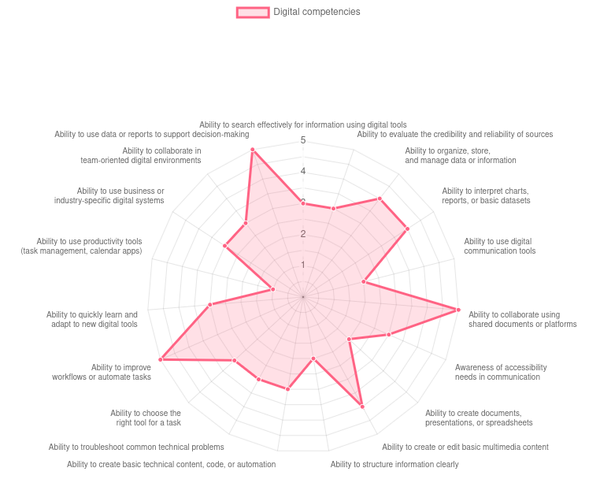
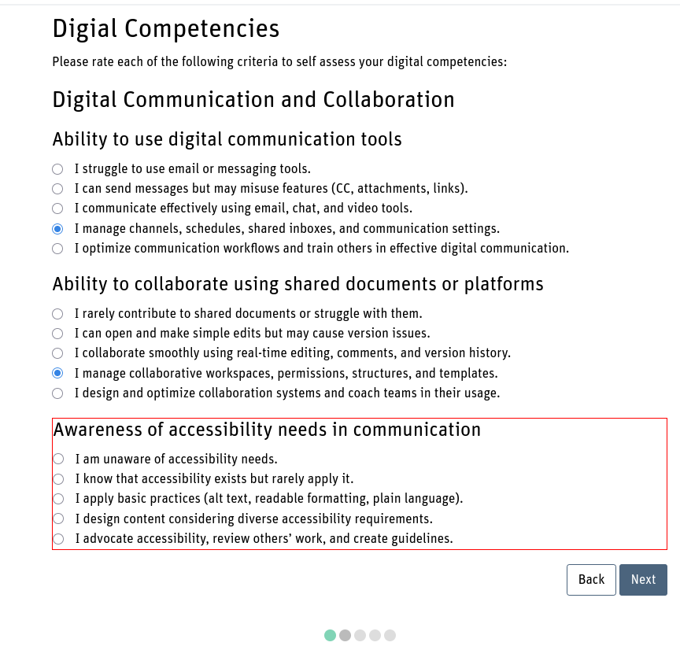
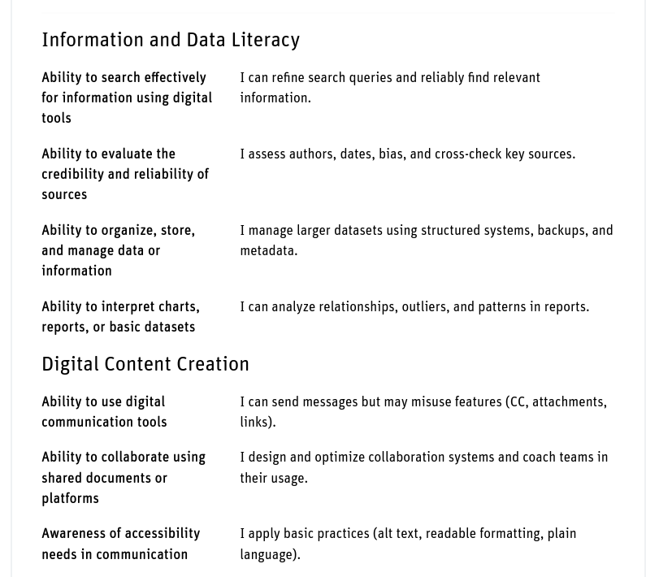

## Competencies wheel

This preset can be used for a self assessment. There is a list of criterias, clustered in dimensions/categories
and with each criteria having a list of levels, that one can choose from. The results is a radar chart, that
takes the form of a wheel. Each spine of that wheel represents on criteria and the data point (radius) displays
the competency level of that criteria.

<div style="margin: 0 25%;">



</div>

The example in this preset is about digital competencies. You may choose other competencies with other
criteria and set it up for your needs.

In general, when this is planned as a self assessment, the entries should need an approval by the teacher
and the teacher should never approve them. So they remain private and every student is able to see his own
data only.

Also, it makes sense to allow one single entry only.

### Implement own criteria

In order to implement your own criteria, there are some changes required in this preset. If you follow
the steps carefully, the functionality should not break. Be aware that in other languages with special
chars, there might be some additional changes necessary so that the code remains working.

### Dataset

The dataset of the criteria is located in the *Javacript Template*. There is a `competencies` object of
the following form:

```
const competencies = [{
  "dimension": "Name of dimension / category 1",
  "criteria": [{
    "label": "name of the criteria 1.1",
    "1": "skill level 1 -> very low",
    "2": "skill level 2 -> intermediate",
    "3": "skill level 3 -> very high",
  },{
    "label": "name of the criteria 1.2",
    "1": "skill level 1 -> very low",
    "2": "skill level 2 -> intermediate",
    "3": "skill level 3 -> very high",
  }]
},{
  "dimension": "Name of dimension / category 2",
  "criteria": [{
    "label": "name of the criteria 2.1",
    "1": "skill level 1 -> very low",
    "2": "skill level 2 -> intermediate",
    "3": "skill level 3 -> very high",
  },{
    "label": "name of the criteria 2.2",
    "1": "skill level 1 -> very low",
    "2": "skill level 2 -> intermediate",
    "3": "skill level 3 -> very high",
  }]
}
{
    ...
}]; 
```

The database activity must have as many fields defined as criterias exist. The name of the
field is in the form of `crit_<dimension>_<criterium>`. Both dimension and criterium is a
number, to identify the correct criterium in the dataset. The field with the name `crit_2_1`
represents the first criterium of the second dimension / category. In the preceeding example
this would be "name of the criteria 2.1".

All fields in the database are of type number. The value is the skill level achieved. In our
example this would be a number between 1 and 3. The preset with the digital competencies uses
5 skill levels.

For each criterium must be the same numbers for the skill levels. Otherwise, the wheel would
not be balanced, because even with the highest skill level that can be achived, the spine of
the wheel looks shorter for criterias that have less skill levels than others. Also the skill
levels should use the same meassurement so that criteria can be compared with each other.

The categories or dimensions may contain several criteria. Not all dimensions must have the same amount
of criteria items. The category / dimension binding of criteria is more for the input to cluster
criteria and not so much for the competence wheel at the end.

### Templates and fields

Depending on the defined fields, the templates must be adjusted, so that each field is used
in a template. If you change the clustering or amount of criterias, the templates need to
be changed.

#### Custom JavaScript

When starting with your competencies, create the data structure in the *Custom JavaScript* template
on the pattern outlined above in the section "Dataset". Below that `competencies` definition, there
are two helper functions that return the criteria label or selected value.

#### Field definition

After having your criterial list ready, the field definition has to be adjusted. Create as many
`crit_X_Y` fields as criteria you have. The order of the fields does not matter. Also the description
is not important. That's not used anywhere in the templates. You can use the criteria
labels there but that has no semantic meaning.

#### Add entry template

In the *Add entry template* make sure for each criterium field there is a hidden field for
each criterium:

```
  <input type="hidden" name="[[crit_3_3#id]]" data-name="crit_3_3" value="0"/>
```

You may also adapt the headline and the paragraph denoting what to do.

The rest of the template can remain as it is. There is kind of a slider where each slide
contains the criteria and level desctiption of one dimension. For each criterium a level
needs to be selected with the radion buttons. All criteria must be responsed before continuing
to the next slide. There is an idicator at the bottom, on which slide the user is and what
is still left to answer.

Appearance of the slider and the indicator can be handled inside the template directly by
changing the code or by modifying the *Custom CSS* template.

<div style="margin: 0 25%;">



</div>

The screenshot shows one slide where the skill level of the criteria of one dimension can
be entered. The headline "Digital competencies" and the following paragraph come from the
hard coded html in the template. The headline "Digital Communication and Collaboration" is
the name of the dimension, followed by the criteria and the criteria level. The place
holders are in the template. These are filled by Javascript inside the template.

At the bottom the dots are the indicatior on the progress of the form. Whenever one clicks
the next button but not all criteria are responded, a read frame is drawn around the criterium
and the skill levels. The appearance is controlled in the css. In the html just a class is
added to the block.

#### Single view template

The *Single view template* contains very little HTML. There is a placeholder where the radar
chart is put into and then Javascript that handles the data and sets up the radar chart.

Inside the Javascript there is a section where the data is defined:

```
data: [ 
  [[crit_1_1]], [[crit_1_2]], [[crit_1_3]], [[crit_1_4]],
  [[crit_2_1]], [[crit_2_2]], [[crit_2_3]],
  [[crit_3_1]], [[crit_3_2]], [[crit_3_3]], [[crit_3_4]],
],
```

Make sure that all you field placeholders are included in ascending order. This piece of code
later is replaced with the numeric values from the fields and is a long array with the data points.

#### List view template

In the *List view template* the block for each entry must be changed only. Inside this block there
must be the following html snippet for each criterium:

```
<div class="row my-3 align-items-start justify-content-start">
    <div class="col-5 col-lg-4 fw-bold">crit_1_1</div>
    <div class="col-7 col-lg-8 ms-n3">[[crit_1_1]]</div>
</div>
```

All dimensions are listed here as well as sub headlines. If you have a different number of dimensions
than this preset, also add/remove the subheadline for the dimension:

```
<h4>dim_1</h4>
```

The `dim_X` and `crit_X_Y` placeholders are exchanged for the real label of the dimension and criterium.
This is done by the Javascript in the footer block after the data is loaded. The placeholder `[[crit_X_Y]]`
is aready rendered by the server with the submitted value for that criterium. That is a single number.
The Javascript in the footer block replaces that number with the label for the competency level within
that criterium.

<div style="margin: 0 25%;">



</div>

This screenshot is the list view with the self assessment of one user for the first two dimensions.

#### Custom CSS

Many styling and also the functionality for the slider in the *Add entry template* are set in the
custom css. Here, fontsize and colors can be ajdusted. The appearence of the radar chart in the
*Single view template* is not defined here.

#### Customizing the radar chart

Some important thing are the axis labels in the radar chart. The definition of the labels for each
spine is done in the *Single view template* inside the `getLabelsForWheel()` function.

In this preset the default behaviour is that at the top and the bottom of the wheel, the label is
displayed in one line because there is enough space. As soon as the labels are more at the side, there
is less space hence the long labels would be cut of. To prevent this, the function tries to split the
label into 2 lines at some space near the middle.

If you want a simple list of all criteria, then this function will help you:

```
const getLabelsForWheel = function() {
  return competencies.flatMap(d => d.criteria.map(c => c.label));
}
```

This returns a list of criteria: `['Crit 1.1', 'Crit 1.2', 'Crit 2.1', 'Crit 2.2', 'Crit 2.3']`

If your criteria are shorter and have a "block" word in the middle e.g. "for" or "to" then you can
split the labels in the following way:

```
const getLabelsForWheel = function() {
  return competencies.flatMap(d => d.criteria.map(
    c => c.label.replace(
      /\sfor|to\s/,
      x => " " + x.trim() + "\n"
    ).split("\n")
  ));
};
```

This may return a list like: `[ ['Crit 1.1 for', 'the impatient'], 'Crit 1.2', ['Crit 2.1 to', 'die for'] ]`

To display labels in several lines, the label is split into an array, rather than insert a line
break only.

If you want to display the dimensions only, the following function shows one label at the first
spine for that dimension. Other spines of the same dimension have no label. Technically this is
done by building an array with the number of criterias, and the first of each sub array filled
with the dimension property.

```
const getLabelsForWheel = function() {
  return competencies.map(c => c.dimension)
    .flatMap((dim, idx) => [
      dim,
      ...Array(competencies[idx].criteria.length - 1).fill('')
    ]);
}
```

The retuned array has a label for the dimension, followed by empty strings as many as criterias are
in the dimension. In this case, the dimension 1 has two criteria, the dimension 2 has three criteria:
`['Dim 1', '', 'Dim 2', '', '']`

The tooltip that is composed whenever one hovers the data point at the spine is composed of the
dimension in the tooltip title. The content holds in the first line the criterium label and in the
second line the skill level that was choosen. Again the two lines are composed from an array.
