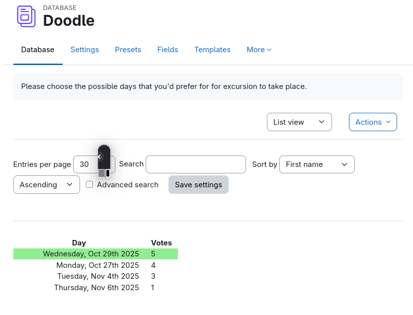
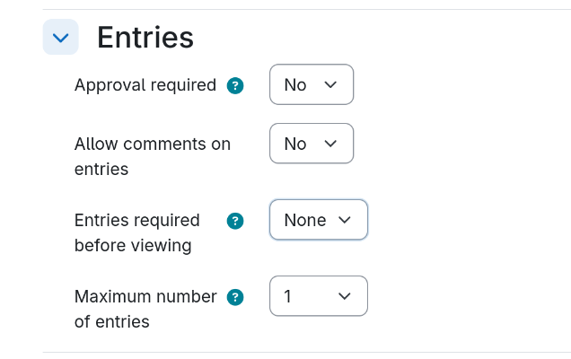
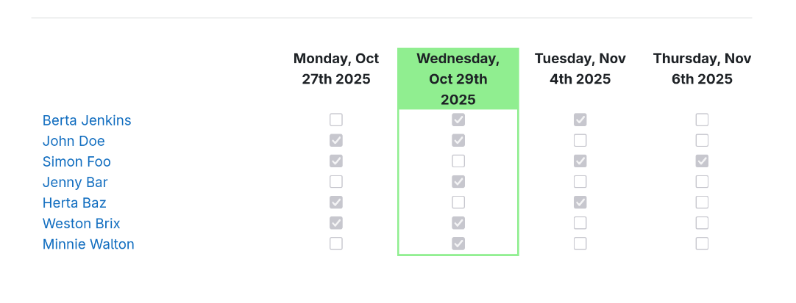

## Doodle like selections

This is a preset to have students select options from a list to find the most preferred
option. It basically works like a Doodle when selecting dates, but can be used for other
things as well.

<div style="margin: 0 25%;">



</div>

This example works with a list of dates, to select the most suitable day for an event. Each
student can make one entry only. However, the student may change the selected options.

The *List view template* collects all data and summarizes the votes for each option.

The settings must be set that each student is allowed to add one entry only. Approval is not
needed and the results could be shown immediately. This is pretty much the same behaviour
as in the original Doodles. Also, the participants have the change to delete their entry and
reenter a new one.

<div style="margin: 0 25%;">



</div>

You might change the "Entries required before viewing" to 1, then the student must provide
a selection first before viewing all the votes.

This example contains a description and the checkbox is set to display the description in
the course. The description contains a sentence, what the selection is good for. Unfortunately
when adding an entry, this description is not shown. Therefore, you must add one or two sentences
manually in the template above the placeholder that displays the option list.

### Field type

The field type for the choice list is *Checkboxes*. The possible values are stored in one
line for each option. Basically anything can be written there. The presented list of options
is from top to down.

Some more efford needs to be done when presenting the result list. The easiest way is to
sort the selected options by votes. No mather what the original option string was, this
ensures that the most selected option is listed first, down to the least selected option
(that got at least one vote). Options that didn't receive any votes are not listed here,
because these do not appear in the result set.

### Ordering the entries

On the *List view template* the entries can be displayed either by some chronological or
alphabetic order, or by votes received. The latter is the easiest way to display the selected options.
The current set contains both methods implemented, with the order by votes as default. If you want
to sort the entries chronological, then line 32 of the `listtemplatefooter.html` which reads:

```
for (const [item, count] of Object.entries(orderedCnt)) {
```

needs to be changed to use `ordered` from the chonological sorting above.

**Note:** only the selected options appear in the list of votes. Options that have not been selected
by any of the participants, do not appear in the list. This is unlike the original Doodle where
all options are displayed.

When entering the data, the options appear as defined in the field definition. You still can
order them by javascript manipulating the content of the *Add entry template*. However, it
makes more sense to put the options into the desired order in the field definition.

### Chonological ordering entries

When sorting the entries by the item, especially if it's a date, the string must somehow
be converted into a date in order to compate the date objects with each other. The preset
uses the following entries:

```
Monday, Oct 27th 2025
Wednesday, Oct 29th 2025
Tuesday, Nov 4th 2025
Thursday, Nov 6th 2025
```

Sorting these entries (in the *List view template* in the variable `answers`), the key contains
this item name (e.g. `Monday, Oct 27th 2025`), the value contains the number of votes.

The following code snippet sorts the entries by changing the keys into a date string, create
a date from it and then compare the date objects:

```
function cleanDateString(dateStr) {
  return dateStr.replace(/(\d+)(st|nd|rd|th)/, "$1");
}
const ordered = Object.fromEntries(
  Object.entries(answer).sort(([a], [b]) => {
    const dateA = new Date(cleanDateString(a));
    const dateB = new Date(cleanDateString(b));
    return dateA - dateB;
  })
);
```

The `cleanDateString()` function provides a string, that can be used for creating the date
object. In this case it must remove the suffix from the cardinal numnber e.g. 2nd becomes to
2. The rest of the string is already ready to be used in a date object. 

If your data items look like this:

```
25.02.2026 11-12 am
25.02.2026 2-4 pm
02.03.2026 10-11 am
04.03.2026 4-6 pm
03.05.2026 2-4 pm
```

then creating the date string is a bit more complicated. The string `25.02.2026 11-12 am`
needs to be converted into `2026-02-25 11:00:00` from which a date object can be created.
Here, only the first hour is used, when the appoinment starts. The `cleanDateString()`
function looks like the following:

```
/* Order chronologically by date */
function cleanDateString(dateStr) {
  // Check whether am or pm
  const apm = dateStr.match(/\s*(a|pm)/, "$1");
  // Reformat 15.03.2026 into 2026-03-15
  let strToDate = dateStr.replace(/(\d+)\.(\d+)\.(\d+)\s*/, "$3-$2-$1");
  // Extract the start hour and convert it into 24h notation.
  let hour = parseInt(dateStr.replace(/(\d+)\-\d+\s*a|pm/, "$1"));
  if (apm === 'pm' && hour < 12) {
    hour += 12;
  } else if (apm === 'am' && hour === 12) {
    hour = 0;
  }
  // Add the start hour to the date string e.g. 9am -> 09:00:00.
  strToDate += ' ' + (hour < 10 ? '0' : '') + hour.toString() + ':00:00';
  return strToDate;
};
```

The rest of the code is the same as above.

If you simply have items that need to be ordered alphabetically then the
ordering is much easier. It follows the principle of the ordering by votes,
only that when converting the object into an array, the first element
needs to be compared, and the order is ascending.

```
const ordered = Object.fromEntries(
  Object.entries(answer).sort(([a,], [b,]) => a - b)
);
```

### Show all options in the result

If all options must be shown in the result, then the *List view template* needs some more
profund changes. First, the field definion for the options must be included into the
template. This is done in the header of the template blocks. In addition, the code
must be adapted more profundly to make things work.

<div style="margin: 0 25%;">



</div>

In this screeshot all options have been used. However, you still would see all options even
if one was never selected by a user. The checkboxes are then all unchecked.

Using the values from the field definition of `list_of_choices` from this preset, the
*List view template* must be adjusted like explained in the next sub sections.

#### List view template Header

```
<div class="doodle-result-table">
  <div class="row">
    <div class="col col-4"> </div>
    <div class="col col-2 text-center bold option-value">Monday, Oct 27th 2025</div>
    <div class="col col-2 text-center bold option-value">Wednesday, Oct 29th 2025</div>
    <div class="col col-2 text-center bold option-value">Tuesday, Nov 4th 2025</div>
    <div class="col col-2 text-center bold option-value">Thursday, Nov 6th 2025</div>
  </div>
```

The dates inside the div element must be exacly the same values as in the field definition (no additional
space etc.). The class name `col-2` must be adapted, if you have a different number of option
values. This is basically a grid of 12 columns, the first div with `col-4` holds the user name,
the other 4 div elements with `col-2` span over the remaining 8 columns (2 * 4 = 8).

Instead of the class names, you may also use a percentage with but then must set some additional
style properties so that the div elements appear as columns.

#### List view template Repeated entry

```
<div class="row">
  <div class="col col-4 user" data-selected="[[list_of_choices]]">##user##</div>
  <div class="col col-2 text-center">
    <input type="checkbox" name="id_##id##-1" value="1" disabled="1"/>
  </div>
  <div class="col col-2 text-center">
    <input type="checkbox" name="id_##id##-2" value="1" disabled="1"/>
  </div>
  <div class="col col-2 text-center">
    <input type="checkbox" name="id_##id##-3" value="1" disabled="1"/>
  </div>
  <div class="col col-2 text-center">
    <input type="checkbox" name="id_##id##-4" value="1" disabled="1"/>
  </div>
</div>
```

This is the section that is repated for each entry. Again, important to know is that
the field values must not contain any special char that can be misinterpreted in an HTML element attibute.
Basically, do not use the double quotes.

Again, if you adjust columns in the header via the `col-X` class, you must also adjust the
class names here as well.

#### List view template Footer

```
</div>
<script>
const optionElements = document.querySelectorAll('.doodle-result-table .option-value');
const options = [];
const counter = {};
const getIndexFromOption = function(val) {
  for (let i = 0; i < options.length; i++) {
    if (options[i] === val) {
      return i;
    }
  }
  return -1;
};
for (const e of optionElements) {
  options.push(e.innerHTML);
  counter[e.innerHTML] = 0;
}
document.querySelectorAll('.doodle-result-table .user').forEach((e) => {
  const selectedOptions = e.dataset.selected
    .replace(/<br\s*\/?>/g, '')
    .split('\n')
    .filter(e => e.trim() != '');
  const checkboxes = e.parentElement.querySelectorAll('input');
  for (const item of selectedOptions) {
    const i = getIndexFromOption(item);
    if (i > -1) {
      checkboxes[i].checked = "checked";
      counter[item] += 1;
    }
  }
});
// Get the maximum votes from the counter object.
const maxVotes = Object.entries(counter).map(v => v[1]).sort().pop();
// Mark all column header that have the maximum votes.
for (let i = 0; i < optionElements.length; i++) {
  if (counter.hasOwnProperty(optionElements[i].innerHTML) &&
    counter[optionElements[i].innerHTML] === maxVotes
  ) {
    document.querySelectorAll('.doodle-result-table > .row > .col:nth-child(' + (i + 2) + ')')
      .forEach((e) => {
        e.classList.add('most-votes')
      });
  }
}
</script>
```

The footer contains the Javascript that traverses over the Header part, fetching the option
values, then traverses the rows for each entry, collects the votes from the `data-selected`
attribute and builds up the `counter` object in a smiliar way like the `answers` object in
this preset and most important, sets the checkboxes to checked when the user selected an
option.

Finally, the options with the maximum votes are examined, and the column header gets a
background color set by adding the css class to the div element.

#### CSS adaptions

The most voted option should be highlighted in the table. This is done by adding the
css class `most-votes` to the corresponding elements. The *Custom CSS* template must
get the following definitions:

```
.doodle-result-table .row {
  margin-left: 0;
}
.most-votes.option-value {
  background-color: #90ee90;
}
.most-votes.col {
  border-left: 2px solid #90ee90;
  border-right: 2px solid #90ee90;
}
.row:last-child .most-votes.col {
  border-bottom: 2px solid #90ee90;
}
```

This sets a green backround at the header and sets a border around the column. In
CSS this means that all div container must get a left and right border and the container
in the last row must get a bottom border as well.