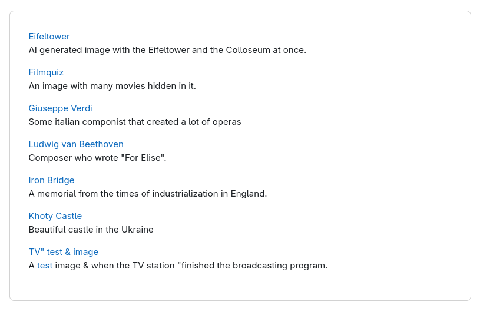
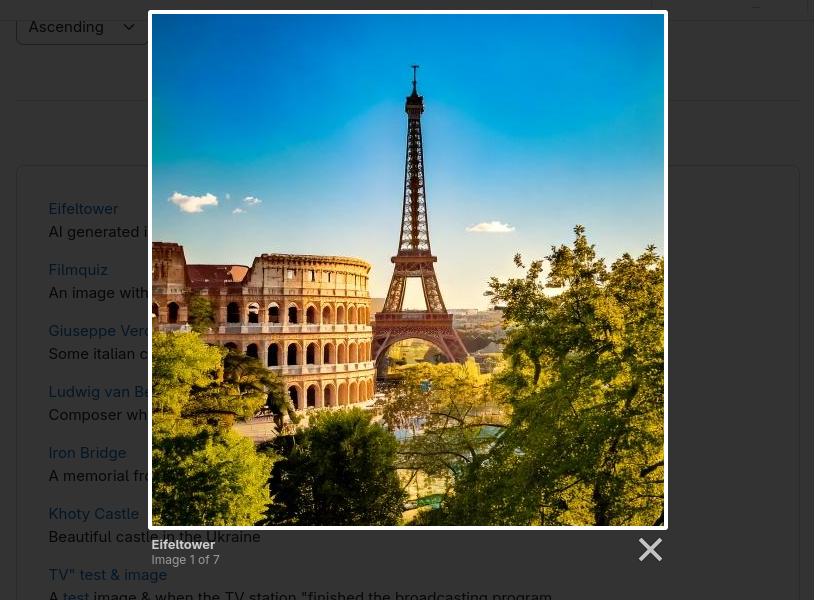

## Image gallery with Lighbox

This is another image collecting preset. The *List view template* makes use
of the [Lighbox](https://lokeshdhakar.com/projects/lightbox2/) library to display the images
in an overlay and have the possibility to flip through the images in the overlay.

<div style="margin: 0 25%">



</div>

The advantage of that approach is that not all images are loaded at once. Instead
they are loaded when you click on one image to view it. Tha make the initial
load of the page faster.

<div style="margin: 0 25%">



</div>

When the `[[image]]` placeholder is used, the following HTML is displayed. displays basically
the following code:

```
<a class="data-field-link" href="..."></a>
```

I enriched the HTML with the content of the *title* and the *description* field and put the
content in span tags. The title is hidden, the description is not. This has the advantage, that
all datafields rendered from your dataset is correctly escaped. The javascript can pick up the
content of such a rendered html element and use it e.g. in an attribute. The html escaping is
done during the initial rendering.

The Javascript that is executed after the page is loaded, transforms the
image list html to be ready for the lightbox library to use. The attribute `data-lighbox="roadtrip"`.
You may add other data attributes as well e.g. for the image caption according to the
library documentation.

If you do not want the list with the image title, then comment out the line `a.innerHTML = title;`
and remove the comments from the next line.

Also, there are many more options, that can be set for the lightbox2 library. These can be
easily added in the `lighbox.option` call.

The CDN links are taken from https://cdnjs.com/libraries/lightbox2. The version with the jQuery included is needed.