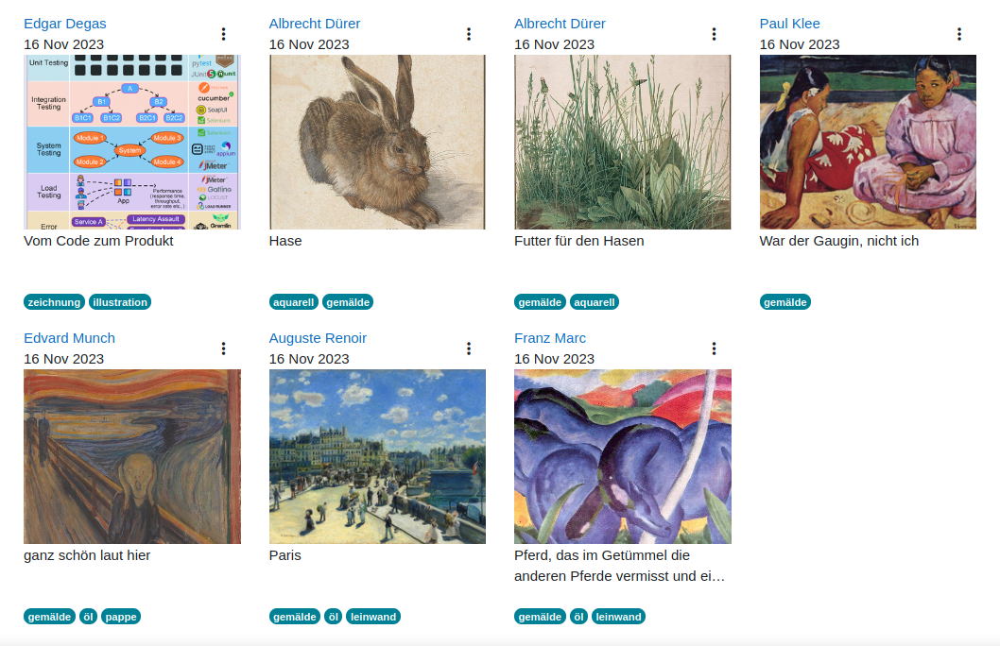

## Image gallery v2

Moodle itself contains a preset for an image gallery. At least in the boost
theme the layout didn't convince me that much. Therefore, I improved it a little.
In my opinion the list view has a more modern look with the responsive tiles.
Furthermore, there are no other customizations done.

The page is responsive. The tiles show up in 4 columns on whide screens, that
shrinks to one column on small screens.

The image caption can have a different length. For a consistent layout only a certain
space is reserved for the caption. Therefore, a long caption might be to be shortened.
This is done in the classes `caption` for a one line caption and `caption-2` for
a caption that may cover two lines. Not that even a caption may need one line
only, the second line remains empty when the 2 line class is used (like in the
screenshot).

The same is relevant for the images. Often galleries use images with a fixed size
(e.g. creating a thumbnail from the original). The database activity has no
such function, the media file is uploaded as it is. Therefore, we reserve
a certain space for the image and hide the overlapping parts. This is important
to keep the aspect ratio of the image. A scaling without preserving the image
proportions does not look good.

The `@media` queries in the *Custom CSS* template use hard coded breakpoints
which fit well for the boost theme. You might need to adjust them if you are using
a different theme. Note that `var(--breakpoint-lg)` cannot be used in the media
queries.