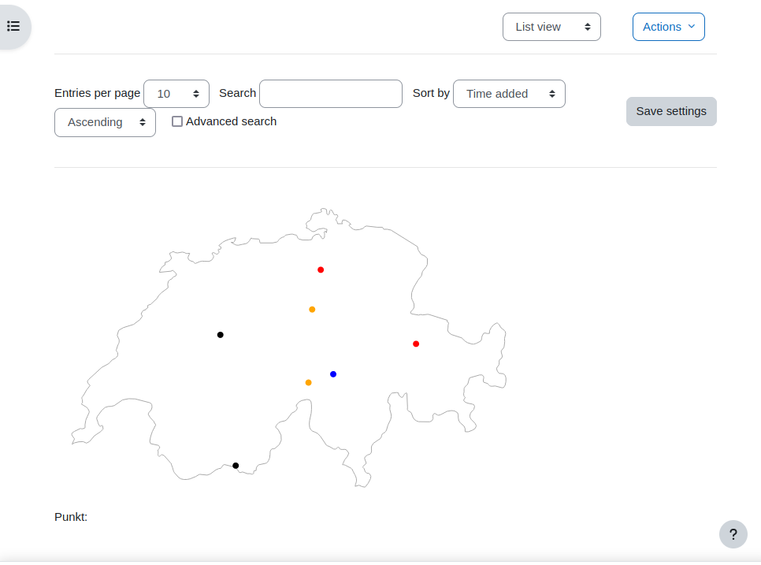
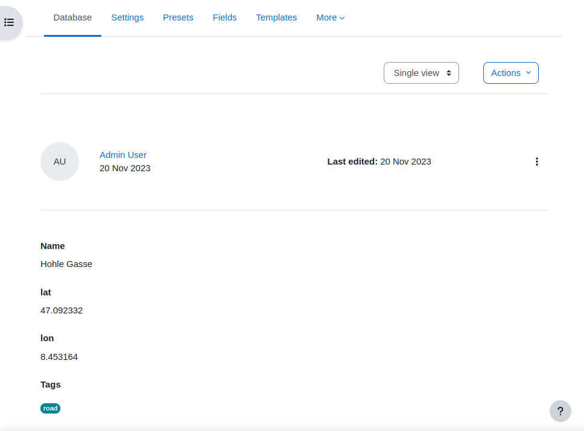
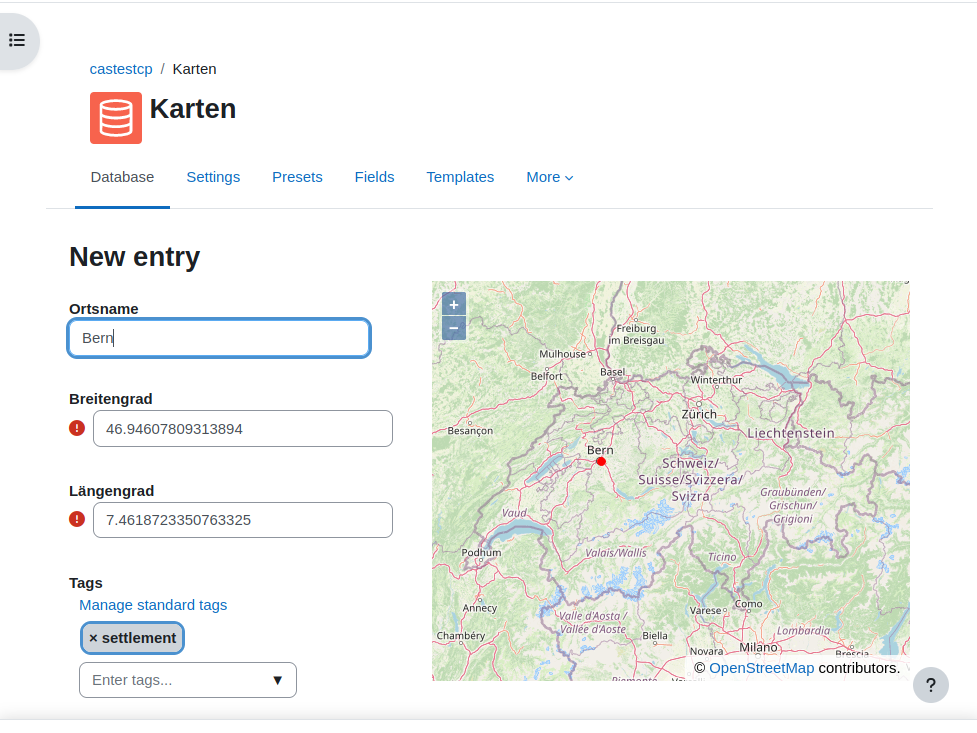

## Map with OSM and SVG

This preset is suitable for a list of places, that may have a name and at least latitude
and longitude to describe the geographic location. The coordinates use the number
field to avoid problems with the encoding when used in the templates inside Javascript.

Furthermore, tags can be used to classify the location, whether it's a village,
road, waters or something else. In this case the dots in the map are painted in
different colors.

A very similar example is [Switzerland place names](../ch-place-names/README.md).

## Installation

After importing the zip file with the templates and the preset, tags for classification
can be adapted in the template *Custom Javascript* in the function `getColor4Tag()`. Just
extend the object that defined a tag name and a color.

The Geojson that contains the map must be stored somewhere. By default, the template
refers to the version from this repository. You might want to download the Geojson
put it as a file activity into your Moodle course and the copy the link of that file
into the variable `geojsonLocation` at the very top of the *Custom Javascript* template.

## Credits

The map data with the swiss border was taken from 
https://www.naturalearthdata.com/ from the Admin 0 Countries.
