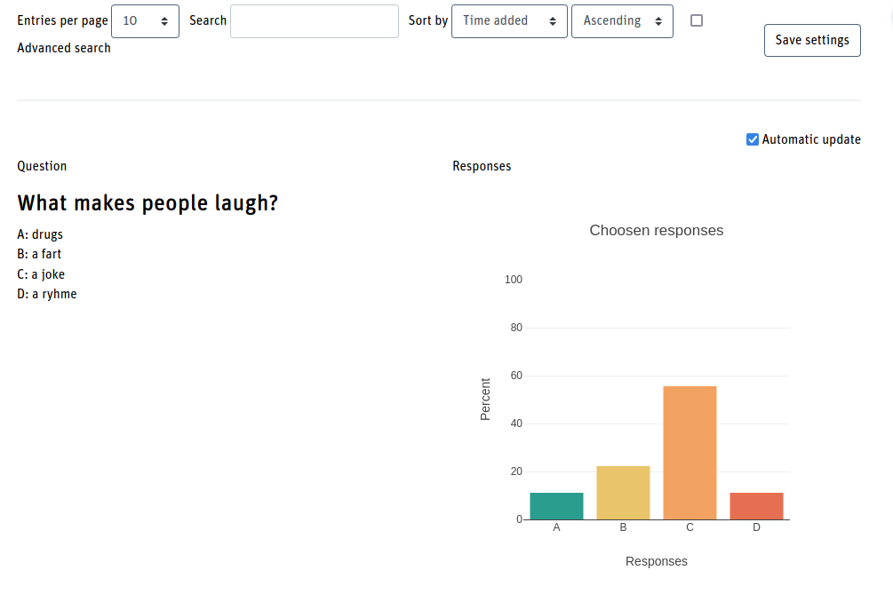

## Multiple Choice Question

This preset is suitable for one multiple choice question where the answers may
be presented to the audience while they are making their choice.

The result (e.g. all answers in the list view) are presented in a bar chart.
The chart is created with the [Plotly](https://plotly.com/javascript/) library.
Also, an automatic reload of the page every 15s can be configured to have a live
update.

<div style="margin: 0 25%;">



</div>

To have a "real" quiz question, in the db settings in the section *Entries* you
should set these options:

* Entries required before viewing: 1
* Maximum number of entries: 1

This allows each member to place one answer only and the results are not shown to
that person before no answer was given.

## Installation

After importing the zip file with the templates and the preset, edit the
*Custom JavaScript* template and set you question at the top by replacing the
values in this code block:

```
const db_question = {
  text: "What makes people laugh?",
  option_a: "drugs",
  option_b: "a fart",
  option_c: "a joke",
  option_d: "a ryhme",
}
```

Note that the values in the double quotes must not contain any special html char
(e.g. &gt;) that would break the html. The values are not escaped.

If you want less options, the templates must be adjusted by removing the last option.
This also counts for the code that is used to draw the chart.

If you want more options, in addition to the template changes, you must also add an
additional letter as a possible value in the database field definition.
