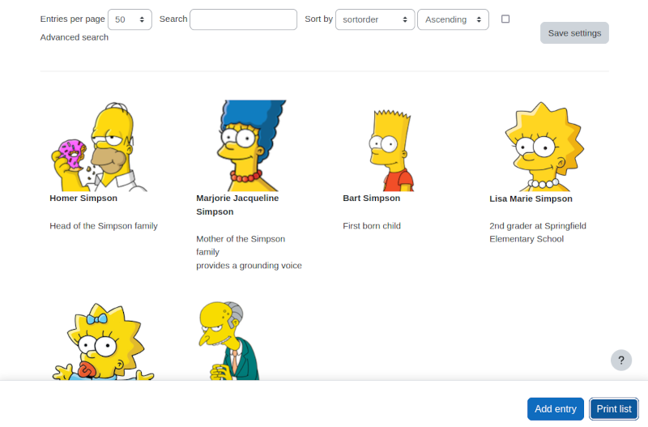
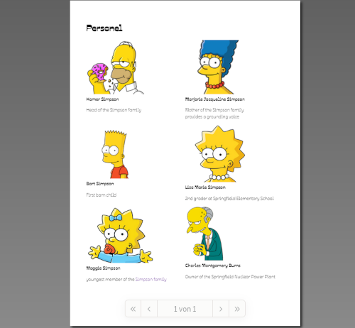
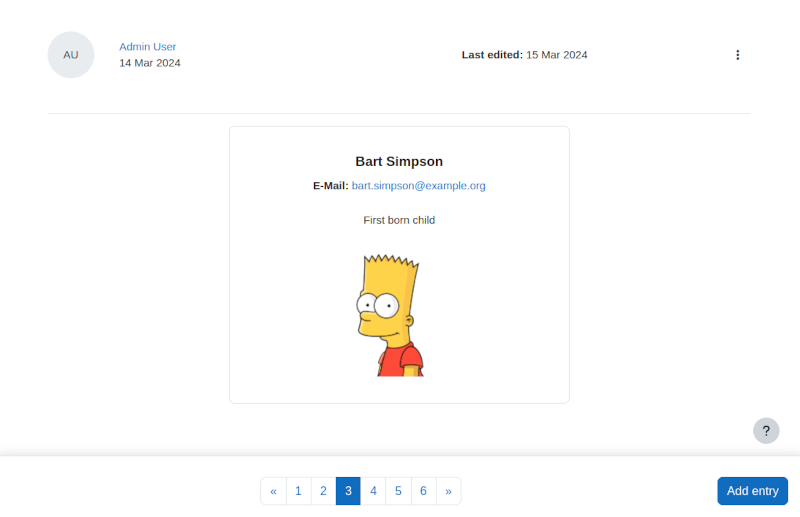

## Personel list (with print function)

This preset was developed for a request of having an easy way to print a list of personel
from a department.

Personal data is administered as database entries in a database activity in a Moodle course.
An additional requirement was to print the list. This is done by using the
[Print.js](https://printjs.crabbly.com/) library that helps printing from the web.

<div style="margin: 0 25%">



</div>


### Prerequistes

The preset contains fields for the name and email of a person, a textarea that may contain information
about the persons profile or position, an image field and a sort order field. The latter is a simple
number that can be used to sort the personel according to a custom hierarchy by starting with the lowest
number for people of the upper hierarchy.

In general it's important to have a picture of the same aspect ratio for all people. Also the `position`
field should contain about the same amount of information. Otherwise the layout will not look good, which
especially tampers a nice printing result.

For a more foolproof way to enter email addresses the plugin
[Database field email](https://moodle.org/plugins/datafield_email) can be used instead of a *Short text*
field. If you have the plugin installed on your Moodle site, change the `preset.xml` so that XML element
in line 34 looks like `<type>email</type>`. This does not change anything at the layout or behaviour but
helps to avoid to enter syntactically invalid email addresses.


### Technical details

The field list that is created via the `preset.xml` contain all english field names but german descriptions.
These desctiptions are used in the templates, in the *Add entry* and the *Signle view* template. Just
adapt the description names to change the language.

The single view contains a nice formatted card layout with all information that is contained in a dataset
except for the `sortorder` which is not used here (and not used in any output).

The *List view* template contains two major functions:

* The handling of the print option
* Ensure that the list contains at least 50 data entries and the entries are ordered via the `sortorder` field.

When the page is loaded the search parameters are checked (usually the first call of the page shows 10 results
only) and in case they need to be adjusted, a click on the "Save settings" button is triggered and the page
gets reloaded.

After the page as been fully loaded the "Print" button can be added to the sticky footer. Clicking the
button prints only the list of entries without the surounding html of the page.

### Adapting the output

When the html fragment is printed, the styles of the website are not available. This is important to know.
The responsive output is not preserved because the bootstrap styled are missing. This is also no problem
because paper is not responsive. Therefore, fixed values (in terms of columns or box size) for the data
entries can be used.

The styling of the print output can be controlled in the footer of the *List view* template. The
print.js is controlled by a json configuration:

```
const printJsConfig = {
  printable: 'person-grid',
  type: 'html',
  header: headlinePrint,
  headerStyle: 'font-weight: 800;font-family:CustomFont;',
  style: `
    @font-face {
      font-family: CustomFont;
      src: url(https://fonts.gstatic.com/s/ojuju/v1/7r3IqXF7v9ApbplSr4kw3A.woff2);
    }
    .list_picture {max-width:300px; height: auto}
    .col {float: left; width: 50%; break-inside: avoid; font-family: CustomFont;}
    .font-weight-bold {font-weight: bold}
  `
};
```

The `style` key contains all styles. Because the values is in backtics you may use several lines
here. Note: when your side needs a custom font, then just change the URL where you load the font. In
this sample a Google font is used. If you do not need a custom font, you may also delete the
`@font-face` directive and the `font-family: CustomFont` part from the styles.

The header of the print output is set in the key `header` that is filled via the `headlinePrint`
variable. This variable is defined a bit more above the print.js configuration.

<div style="margin: 0 25%">



</div>

Because of the small images there is a slight misplacement in the print preview, because the
images are not upscalled. Your images should have at least a width of 300px and the same aspect
ratio.

Both, the header for the print output as well as the "Print" button are language dependent. The
language is checked by the document language. If you do not need language dependent strings you
may omit this logic and hard code the strings. Also, even the heading and the print button are
language dependent, the input template is not. The field labels are taken from the description
in the field definition. If you want language dependent strings there as well, a possible solution
is shown in the example [Sign up for a project](../project-signup).

<div style="margin: 0 25%">



</div>

The *Single view* template uses the email address (and actually creates a mailto link), the *List view*
template does not include the email. In case you want have the email included as well in the list view, add
it in the content of the `listtemplate.html` as a row e.g. between the name and the position:

```
<div>
    <a href="mailto:[[email]]">[[email]]</a>
</div>
```
or without the mailto link:
```
<div>[[email]]</div>
```

Use a class in the div element, e.g. `mt-1`, `mt-2` or similar to have some spacing between the name
and the email address.

You may also have the mail in the list view at the page but not having it printed. In this
case add the mail address like this:

```
<div class="email"><a href="mailto:[[email]]">[[email]]</a></div>
```

and in the `printJsConfig.style` property add the following:

```
.email { display: none; }
```

to hide the email div element in the print view.

### Attribution

All Simpson images used in the screenshots were taken from the english Wikipedia and
cropped to fit into the current layout. The images are all released as a publicity photo from
the website [foxflash.com](https://www.foxflash.com/), an official Fox publicity photo site,
and as such should not hamper 20th Century Fox's ability to use or sell this image. Statement on main FoxFlash page states:

> All materials in the FoxFlash Web site, including the photography,
> graphics and text, are the copyrighted property of FOX BROADCASTING
> COMPANY, its affiliated companies or licensors, and are distributed to
> the press solely for the promotion of FOX programming and the news or
> entertainment media owned or legally licensed by your company. These
> contents cannot be sold or distributed to a third party, provided
> however, that syndicates receiving these materials may distribute them
> to the subscribers solely for distribution in the news or entertainment
> media. Any other use of these contents is a violation of copyright laws
> and is prohibited.

This tutorial, in which the images are used, does not contain any damaging or disparaging content that could taint the reputation of the show, and, in fact, thus counts as a valid "publicity site" by serving as a way to generate publicity for the show by creating awareness. 

