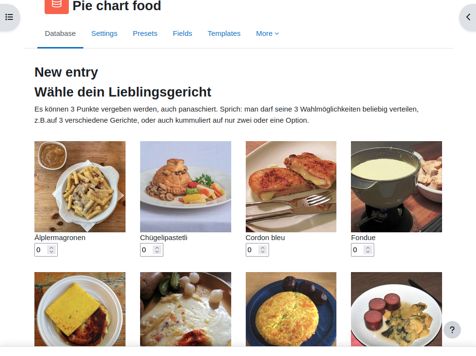
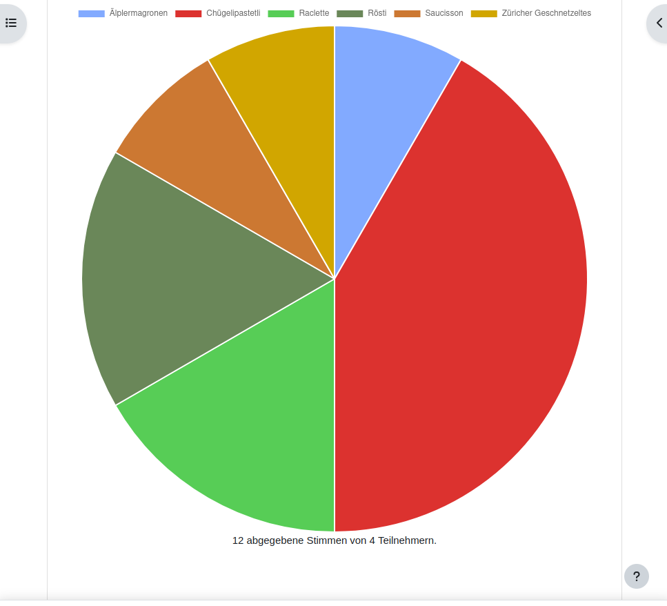

## Pie chart accumulated

This entry works like a voting. The user (database entries) can be done by voting the
favourite food among a selection of 9 choices. With each entry three votes can be placed.
Thia can be 3 votes for one choice but the 3 votes may also be distributed between
different choices.

The accumulated view (list view of all entries) is put into a pie chart by counting
the votes for each choice.

The frontend checks when the user tries to place more than three votes (this is done
in `checkNewInput()` in the *Custom JavaScript* template. However, one must
be aware that by manipulating the POST request it's still possible to send any
values to the backend that would be considered being an invalid vote.
Real systems (e.g. a voting machine) must have checks on the server side
whether the request is valid or not. With the database activity we do not have the choice
to add backend checks.

At the single entry page, instead of showing the selected options, the data is used
to display an image for each vote. Repeated images on that page mean that the user
gave more than one vote to the same option.

## Installation

The images for the choices are taken from this repository. You may change the
function `getImageHtml()` in the *Custom JavaScript* template to have your own images.
Also, because of the layout, each image has a size of exactly 250x250 pixels.

## Credits

The images were all taken from Wikipedia, cropped to have a squared format and scaled down.

- aelplermagronen.jpg: [Adrian Michael](https://commons.wikimedia.org/wiki/User:Parpan05) CC BY-SA 4.0
- chuegelipastetli.jpg: Free Art License - «A.Savin, Wikipedia».
- cordon-bleu.jpg: Rainer Zenz - GPL
- fondue.jpg: [Hic et nunc](https://commons.wikimedia.org/wiki/User:Hic_et_nunc) - CC BY 2.0
- polenta.jpg: [Joadl](https://commons.wikimedia.org/wiki/User:Joadl) - CC BY-SA 3.0
- raclette.jpg: [Ka23 13](https://commons.wikimedia.org/wiki/User:Ka23_13) - CC BY-SA 4.0
- roesti.jpg: [Poupou l'quourouce](https://commons.wikimedia.org/wiki/User:Poupou_l%27quourouce) CCA 4.0 
- saucisson.jpg: [Хрюша](https://commons.wikimedia.org/wiki/User:Chriusha) - CC BY-SA 3.0
- zuercher_geschnetzeltes.jpg: Christian Michelides - CC BY-SA 4.0