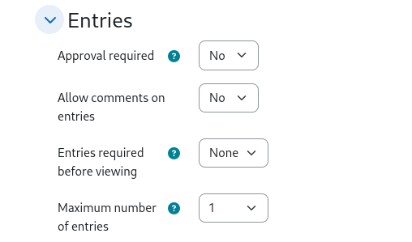

## Project selection for student groups

The use case of this preset is, there is a list of projects. Students
are put into groups. Each group should be assigned to one project. Each
group should be able to add one entry only. An entry consists of 3
choices with priortiy for first, second and third choice of a project.
On the list view (for the teacher) all entries are evaluated and for
each group a project can be assigned.

### Intoduction

This dataset is similar to [First, second and third choice](../choice/). The
selection of the option is done in the same manner. The main difference is
that not each single student makes a choice. Only one member of each group is
supposed to add an entry.

The Moodle database activity doesn't support groups very well. When adding an
entry, there is no information of the group that a student belongs to. Therefore,
this information needs to be scapped from the page itself.

At the result list the teacher should get a list of projects and groups that
have selected a project. In order to avoid collisions, a student group can add
three choices ordered by a preference from most wanted to least wanted project.
From the list of data, a result table needs to be created, that checks the
preferred projects from each group, adds them into a list and avoids conflicts so
that each project is once assigned to a student group only.

### Setup of the database

The setup is similar to the [First, second and third choice](../choice/) preset. There should
be one entry being added only. We need to check for separate groups and students
should not see other entries (while the latter is not a hard requirement). In general
the preset should work.

The group settings may look like in the following screenshot. Not, you must define
groups first in your course so that this setting may take effect.

Note: this preset works with **one** group for each stundent only. Also, the "sepatate goup" mode must be used. Otherwise, the group name cannot be scrapped from the page when adding
an entry.

### Setup of the projects

The project list is a simple json array in the *Custom JavaScript* template. Just add
a list of strings and replace your list with the placeholder project names. The
labels for 1st, 2nd and 3rd choice are taken from the database field descriptions.
However, there are a few places in the templates that might be adjusted, where the
labels from the field definition could not be used.

### Functionality

When adding a new entry, each student usually starts with the list view page. In case
of own entries (and entries from the members of the same group), these are displayed there.
If another member of the same group has added one entry, the current student should
not be able to add an entry. Therefore, we must derive the current group name from the
page (that is displayed on top of the content, above the database content). Second,
we check whether the student gets a list of entries displayed and we try to see if the
group name appears there. If this is the case, the sticky footer is hidden, so that the
student may not add an entry himself. Also, the already selected choices of his group
mate must be displayed.

There is no check on the add entry page, whether the student is allowed to add an entry.

The teacher gets all entries listed on the "List view template* (if not, increase the number
of entries to be displayed). From the results, a table is built that accumulates all entries
and tries to match the best choices.

First, the project list is traversed and if a group has set that project at it's most wanted
choice, the project is assigned to that group. If an assignment cannot be done anymore, the
groups second and third preference is remembered. With the next run, the second choice is
assigned to a group, that has no assignment yet. After this is done, all third choices are
handled the same way. If a group is still without project assignment, then a random
assignment of the next "free" project is done. Because the selection is not transparent at
the page itself, behind each assignment is a label that explains the reason, why this
project assignment was done.

The teacher still has the chance to export the dataset as CSV or Excel in order to look
at the plain values submitted by each group.

### Problems

Moodle does not support groups very well in the database activity. Also, information from a
user (e.g. the groups where he belongs to) cannot be easily accessed. Therefore, the current
preset works in this limited way.

Limitations are:
* Works with one group per student only
* Hiding input elements may not prevent a student group to add several entries