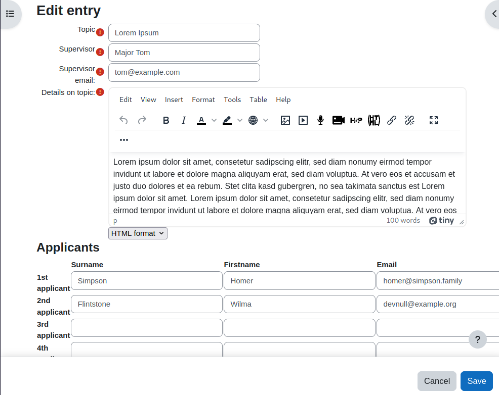
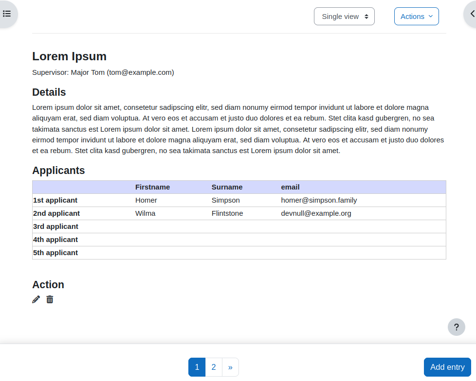
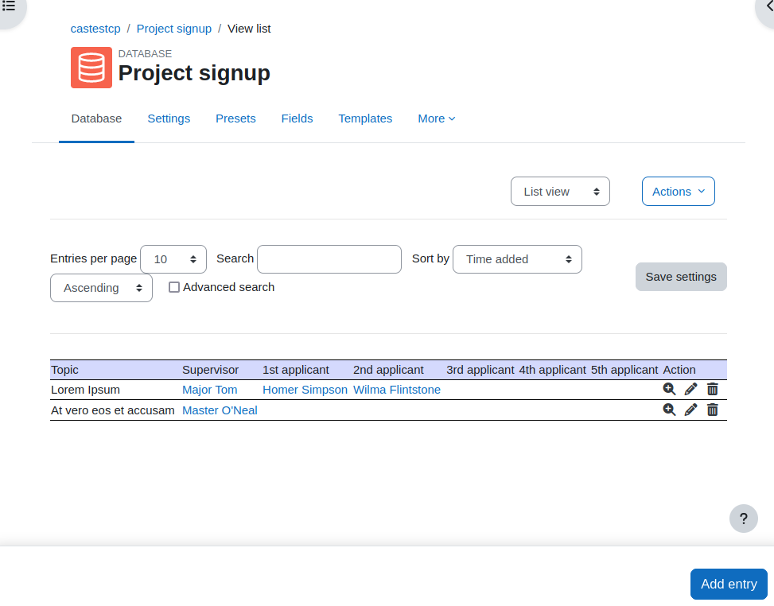
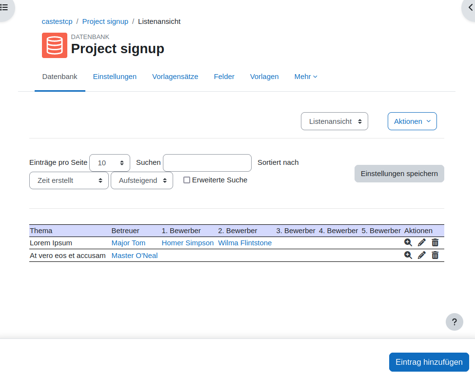

### Sign up for a project

This is an example that I have seen often in use. Some group work, project or
even a thesis must be done by the students. There is a list of given projects and the students
can pick one of them. For transparency everyone in the course can see who has chosen which topic.
The undecided has a chance to see which topic can still be taken.

The person who has created the dataset must add a student to one project, because
only persons with editing rights (usually teacher) are allowed to change an existing dataset. The sign up process
is manually e.g. the students need to contact the teacher.

The example consists of two groups of fields. One group defines the project itself, which
is `topic`, `topic_details`, `supervisor`, and `supervisor_email`. The second
groups of fields is for the possible 5 applicants that can pick one topic. Fields
are `app_X_surname`, `app_X_firstname`, `app_X_email`. These are repeated
5 times with `X` being a number between 1 and 5.

<div style="margin: 0 25%;">




</div>


In the *New entry* as well the *Single view* template the data is grouped by these
two criteria resulting in two tables (or one subheadline and paragraph and one table).

### Multi language

It may not make much sense in this case (because there is a lot of textual content in
one language that is not translated), but it's possible to have the field labels and other
content in different languages. To achieve this, some javascript tricks need to be done.

<div style="margin: 0 25%;">




</div>

Inside the templates we use some HTML with special annotations. In this example the
table header with firstname, lastname and email may look like this:

```
<tr>
  <td data-lang="surname">Lastname</td>
  <td data-lang="firstname">Firstname</td>
  <td data-lang="email">Email</td>
</tr>
```

The content inside the tags is the default value, the `data-lang` attribute
contains the identifier for this language string.

Language strings are defined in the *Custom JavaScript* template like this:

```
const dbPresetLangStr = {
  "en": {
    "firstname": "Firstnamw",
    "surname": "Lastname",
    "email": "Email",
  },
  "de": {
    "firstname": "Vorname",
    "surname": "Familienname",
    "email": "E-Mail",
  },
}
```

When the page is loaded, an event listener on the `DOMContentLoaded` event triggers
a function that:

1. Try to determine the current language (from the page or the browser settings).
1. Check that the global `dbPresetLangStr` contains the determined language.
1. Selects all HTML elements with the `data-lang` attribute, and uses the attribute
value as a property for the language object.
1. Replaces the content of that HTML element with the value from the language object.

So, if you use English as the default inside the templates, then you actually do not
need the "en" section above. Only other translations are required here.

Also, keep in mind that the whole content of the HTML element with the language
attribute is replaced. If you need parts of it, then enclose the text that
can be translated with a span tag, like `<span data-lang="de">to be translated</span>`.

The content is still not multi-language capable.
