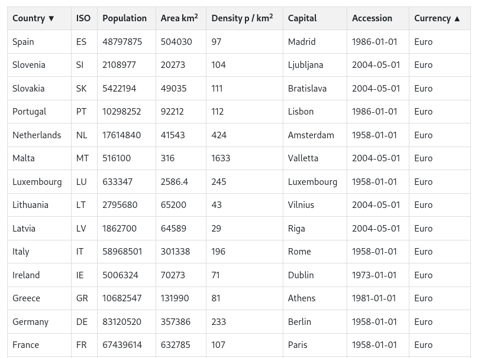

### Table with sorting by several criteria

This preset shows the demonstration of a table in the list view. The table is sortable
by several columns at once. The coding was taken from
[a blog post](https://wpdatatables.com/javascript-sorting-tables/) of the wpDataTables
plugin for Wordpress and adapted to be generic for the database activity in Moodle.

<div style="margin: 0 25%;">



</div>

### Technical details

The *List view template* is modified. The datasets are written as HTML to the page.
Like in the similar example [table sort](../table-sort/README.md) the data is
written as HTML to the page, with a table header, the data and a table footer.

The *Footer* box contains the Javascript:

* Reload the page if the data is not complete (27 EU countries and a header makes
28 table rows that must be present).
* Calculate the population density from population and area.
* Register event handlers for sorting the table data.
* Functions that do the actual sorting.


### Multisort

Motivated by [this forums post](https://moodle.org/mod/forum/discuss.php?d=461416)
this table can be sorted by several criterias. You may click on one column to sort
the rows by this column. Then you can click another row, and elements with the same
value in the first column to be sorted are now sorted by the second column.

An example with the EU countries can be, sorting by currency and then sorting
alphabetically in ascending order. After clicking on the currency column, the rows
are sorted by the currency ascending in alphabetic order. All Euro countries show up
first followed by Poland, the Czech republic and others that do not use the Euro.
Now clicking the first column orders the countries alphabetically. You may click
another time to change the order to descending. What you realize is that the
countries are still grouped by the currency, and inside the grouping ordered again.

At the end of the click on the currency column first and then twice on the country
column should list Spain at the top. This is the country that uses the Euro and comes
last in the alphabeth.

At the moment sorting cannot be canceled, you have to reload the page to have no
sort criteria and may start from scratch.

Also, sorting is simple, unlike the table sort library from the other example
comparing two values is very simple done on the values, either numeric or alphabetical.

### Data

The data is the same that is used in the [table-sort](../table-sort/README.md) example.
Also the density is calculated here on the fly and not contained in the dataset.

For your own data, adjust the two variables `expectedRows` and `maxRowsToDisplay`.
The first is the amount of datasets, that you expect to show. In our case these are
all EU countries which are 27 + 1 for the header row. The latter is the variable
how many data rows to load at once. In general, this can be set to 1000 at a maximum
(limited by Moodle itself). You might lower the value if the loading is costly because
your data set has too much data to fetch.

If you have not a fixed data set but a growing number, then counting the table rows
will not work reliably. In this case check the value for `perpage` eighter from the
url, or checking the value of the select element (in this order).

```
let perpage = 10;
const match = window.location.href.match(/perpage=(\d+)/);
if (match) {
  perpage = parseInt(match[1]);
} else {
  const sel = document.getElementById('pref_perpage');
  if (sel) {
    perpage = parseInt(sel.value);
  }
}
```