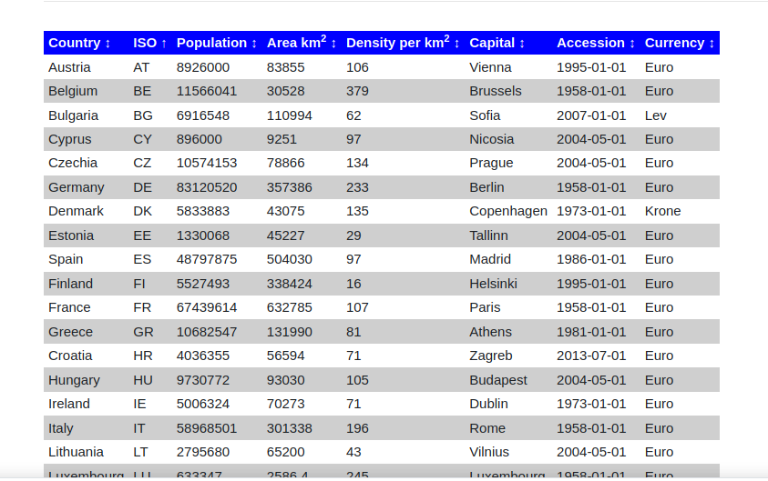

### Table with sorting per column

This preset shows the demonstration of a table in the list view. The table uses
the Javascript library [table-sort.js](https://github.com/LeeWannacott/table-sort-js) to
add sorting the rows by a column.

<div style="margin: 0 25%;">



</div>

### Technical details

The *List view template* is modified. The datasets are written as HTML to the page.
The table header and the include of the Javascript library is done in the *Header*
box of the template. The table rows are written in the *Repeated entry* box. The
*Footer* contains basically the reload of the page when the search terms contain
parameters that now all database entries are shown. The second part calculcates the
population density from the area and the population and fills the content of that
column.

Because of the class names in the table, the sorting functions are automatically
applied once the page is loaded.

Customization of the table sorting can be done by adding specific classes to the
`<table>` and `<th>` elements. A detailed description can be seen at the
[table-sort.js](https://github.com/LeeWannacott/table-sort-js?tab=readme-ov-file#to-make-tables-sortable)
page.

### Dataset

For demonstration purposes I used a simple data set that can be easily checked
out, the 27 EU countries. The data can be imported using [this CSV file](countries.csv).

Population and area are integers. These could be formatted more readable which is not
yet done here. For the accession date I used a simple short text. Moodle has a special
data type for dates. However this makes the handling more difficult. Also when importing the
data from a CSV, the value of a date type field must be a unix time stamp instead
of a readable date.

Having the data with timestamps would look like this:

```
Netherlands;NL;17614840;41543;Amsterdam;-378691200;Euro
Poland;PL;37840001;312685;Warsaw;1083369600;Złoty
Portugal;PT;10298252;92212;Lisbon;504921600;Euro
```

That is less readable like:

```
Netherlands;NL;17614840;41543;Amsterdam;1958-01-01;Euro
Poland;PL;37840001;312685;Warsaw;2004-05-01;Złoty
Portugal;PT;10298252;92212;Lisbon;1986-01-01;Euro
```

And besides that, with the help of Javascript in the template you may format the
date output as you wish and do not depend on the Moodle internal string variable
(which can be modified, but would use the same format at any place where this
format string is used).