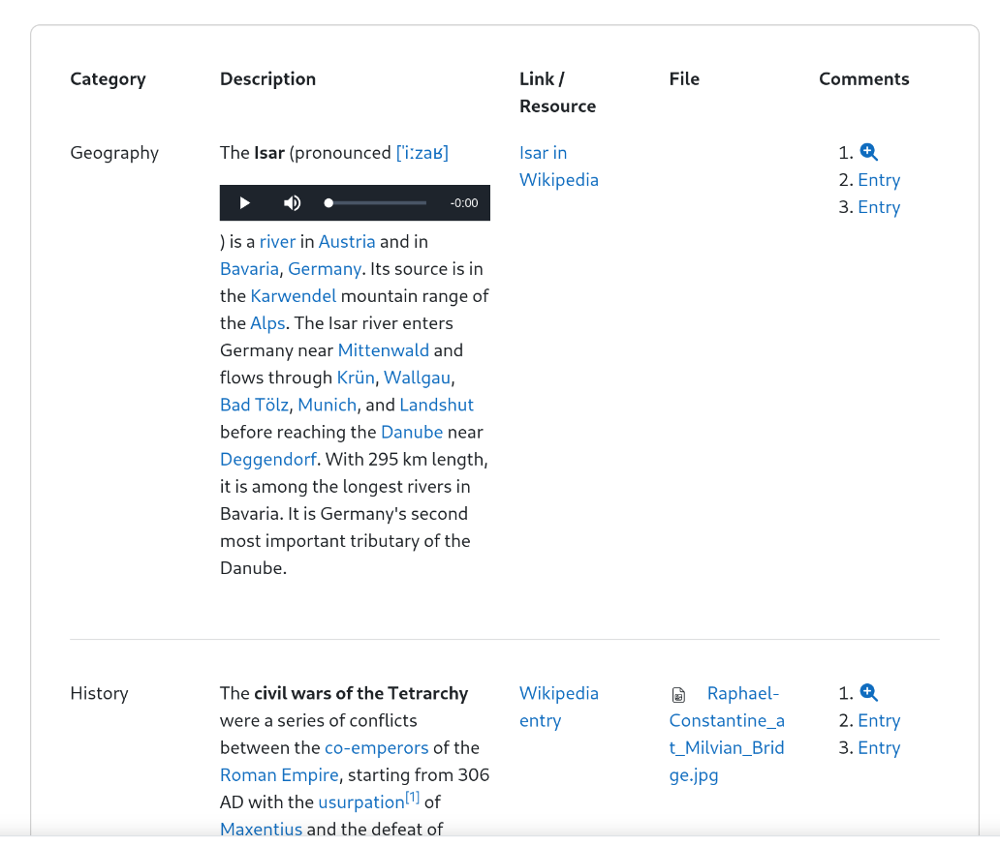

### Table with Bootstrap

This preset shows the demonstration of a table in the list view. The table is build
from divs, using the column grid to build a table.

<div style="margin: 0 25%;">



</div>

### Technical details

The *List view template* is modified. It uses the bootstrap grid to define columns
and rows in order to create a table. In this case there are 4 fields that need to
be placed in the table. The fifth column contains a direct link to the entry (e.g.
the single view).

This is even useful when your list view may display a few data values from a dataset
only and the full expression of the dataset is visible in the details view only.

In general, field names (as displayed in the templates) are used from the description
of the field definition. Changing that description also changes the output in the
templates with one exception. The table header in the list view is hard coded, because
the header block in that template doesn't support the replacements. Therefore these
must be changed manually when changing the description of a field definition.

The last column in named "Comments". This does not directly gives a hint to the
single view link. In the original use case were this preset was developed for,
all entries can be commented. Therefore, to view the comments and add an own
comment, the user must be lead to the single view of an entry to see the comments.

### Column with in Bootstrap

The Bootstrap grid consists of 12 imaginary columns. The table in this example
defines 5 columns with:

* Category with 2 columns width
* Description with 4 columns width
* Link / Resource with 2 columns width
* File with 2 columns width
* Comments with 2 columns width

Adding these column widths (2 + 4 + 2 + 2 + 2) gives a sum of 12. This is how
you define column widths, by using the class name e.g. `col-2` for a column of a
width of 2. If the sum does not match 12, the table may seem awkward because the
line breaks will be at a different position.

Bootstrap explains it's column grid in the [Documentation](https://getbootstrap.com/docs/4.0/layout/grid/).

The preset was used on a Moodle 4.6 and 5.0, the latter working with Bootstrap 5 while the
former still has Bootstrap 4 in place). So this preset should look good in all newer Moodle
versions.

### Link to the entry

In the list view, the table contains a link to the single view of that entry. In
this preset there are three links basically doing the same:

```
<ol>
    <li>##more##</li>
    <li><a href="/mod/data/view.php?d=XXX&rid=##id##">Entry</a></li>
    <li><a class="db-link-entry" href="/mod/data/view.php?d=~~__D__~~&rid=##id##">Entry</a></li>
</ol>
```

This snippet can be found in the list view template in the Repeated entry block. You
may remove the list tags and keep the content of one list entry only.

Version 1 is the easiest way of adding a link to the entry. However, it's also the
version with the least posibility of customization.

Version 2 is the way of adding a link manually and offers more fexibilty in
customizing it. However, the database activity id must be examined from the site
and replacing the XXX. This must be repeated, whenever the activity is copied
or the preset is used again.

Version 3 is the same as version 2, except that the Javascript in the Footer block
of the List vew template replaces the placeholder in the link dynamically.
