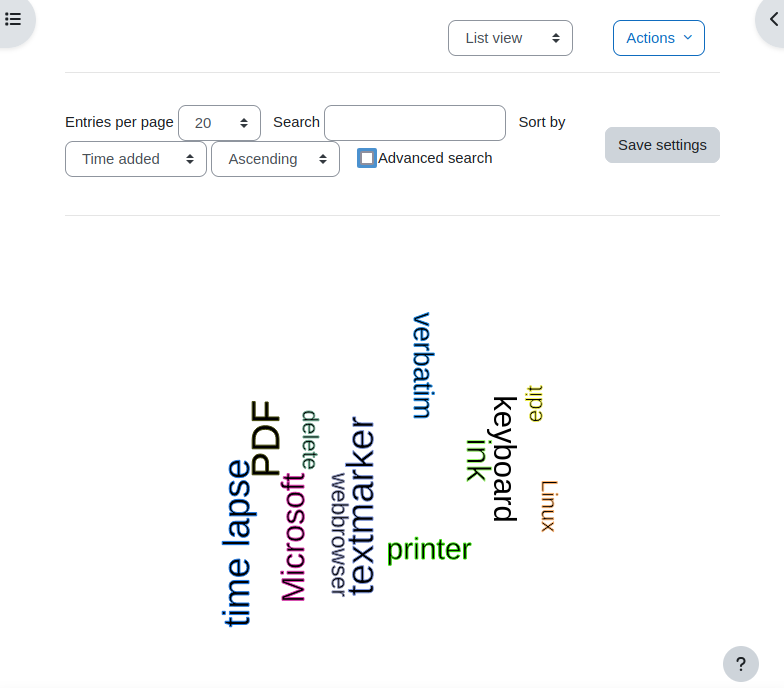

## Wordcloud list

The use case for this preset is to present a list of words. The users may enter
single terms or groups of words. These are taken as they are and a wordcloud
is build from them.

Only the list view template has been modified to display the word cloud.

