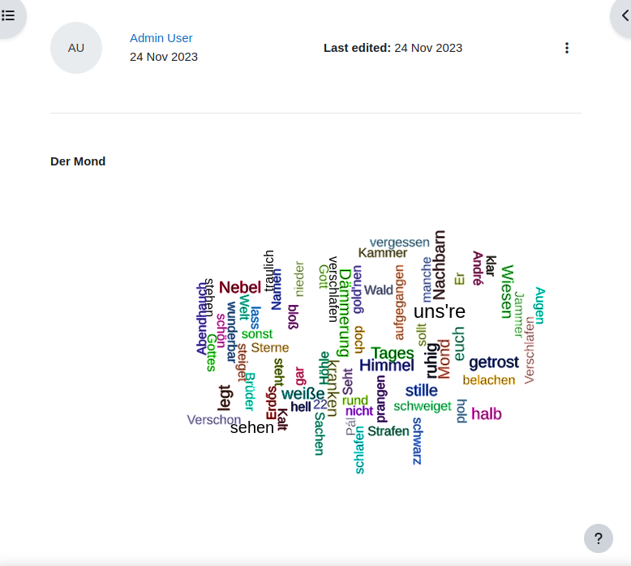

## Wordcloud text

The use case for this preset is to build a wordcloud from a text. The user may enter
a long text (to classify it a bit, a headline can be entered as well, but is not
used for the wordcloud itself).

Texts may be long, therefore before building the wordcloud the text must be processed.
This is done in the following steps:
* Eliminate HTML (which is automatically saved when using the TinyMCE/atto editor).
* Keep normal letters only that would appear in a word, eliminate all other characters. 
* Split the text at the spaces.
* Count the words to use it as a weight for the font size.
* Eliminate all words, that are on a stop list.

Only the single view template has been modified to display the word cloud of the
text. The algorithm that create the cloud tries to place every word at a free
position. If there is no free space found where the word would fit, the word is
skipped. So the word cloud will miss some words that appear in the text.

## Customization

The wordcloud is done in three steps:
* Create a list of words (see above).
* Use the algorithm from the d3.js wordcloud library to calculate where exactly to place the words.
* Create a SVG graphic from these calculations.

The list of words is transformed into an array of word objects named `wordsmapped`. One item
of this array is an object that represent a single word. The object contains
these properties:
* `rotate` the angle how to rotate the word.
* `text` the word itself
* `value` a numeric value that represents the importance of this word.
* `color` a value in which color the word is printed.

Apart from the `text` property, none of the others must be set here.

The list of this word objects is then used in the `d3.layout.cloud()` object. This
is the function that calculates the wordcloud. Many of these functions that are
called here define settings on how the cloud is created. See https://github.com/jasondavies/d3-cloud
for details. Some of the properties that are set above in the array of word objects
are used now in callbacks as input parameters to define the settings.

Whenever you do changes, you should change the word object or the settings when
creating the wordcloud.

The function `draw()` finally takes the wordlist from the layout function and adds a
text element inside the svg.
